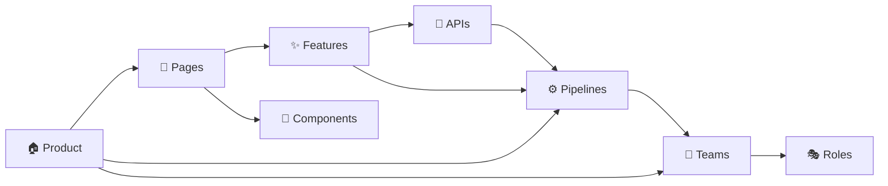

# 🗺️ MOC — DocLens AI Project

> Map of Content for the entire DocLens AI project. Every node links to a deeper MOC or individual note.

---

## Product & Vision

- [[What is DocLens AI]] — Product definition and value proposition
- [[Why DocLens Exists]] — Problem space and vision
- [[Design System]] — Deep Ocean theme, typography, color tokens
- [[Tech Stack]] — Frameworks, libraries, and architecture

---

## User Experience

- [[MOC — User Flows]] — How users accomplish tasks
- [[MOC — Pages]] — The four application screens
- [[MOC — Features]] — Individual features and capabilities
- [[MOC — Components]] — Reusable UI building blocks

---

## Technical Architecture

- [[MOC — Pipelines]] — PDF Extraction → Translation → TTS
- [[MOC — APIs]] — External and browser API integrations
- [[End-to-End Pipeline]] — Complete data flow diagram
- [[Memory & Storage Audit]] — Audit of large-data storage hotspots and memory optimizations

---

## Organization

- [[MOC — Teams]] — Team structure (50 people, 3 squads + shared services)
- [[MOC — Roles]] — Individual role definitions
- [[Escalation Matrix]] — Issue routing
- [[Meeting Cadence]] — Communication rhythms

---

## Reference

- [[Glossary]] — Key terms and abbreviations
- [[Read Aloud Analysis]] — Read Aloud extension architecture & integration strategy

---

## Relationship Map

