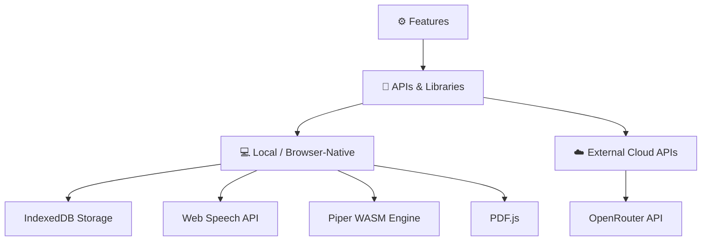

# 🔌 MOC — APIs

> External APIs, libraries, and browser interfaces integrated into DocLens AI.

---

## API Registry

| API / Library         | Category       | Description                                                               | Used By                 |
| --------------------- | -------------- | ------------------------------------------------------------------------- | ----------------------- |
| [[OpenRouter API]]    | External Cloud | Aggregated LLM provider for translation, summary, and explanation prompts | [[AI Translation]]      |
| [[Piper WASM Engine]] | WebAssembly    | Local client-side neural speech synthesis (TTS) generator                 | [[Piper Neural TTS]]    |
| [[Web Speech API]]    | Browser Native | Standard native speech synthesis engine used as a fallback                | [[Text-to-Speech]]      |
| [[IndexedDB Storage]] | Browser Native | High-capacity local storage for document blobs, metadata, and voice files | [[Document Management]] |
| [[PDF.js]]            | Core Library   | PDF text parsing, coordinates positioning, and rendering canvas generator | [[PDF Viewer]]          |

---

## Technical Architecture

---

_Part of [[00 — MOC — Project]]_
