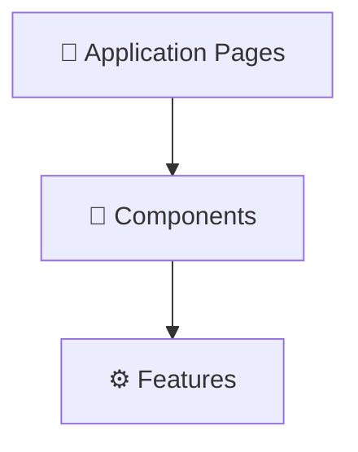

# 🧩 MOC — Components

> Reusable UI components powering the DocLens AI application interface.

---

## Component Registry

| Component              | Target File              | Description                                                       |
| ---------------------- | ------------------------ | ----------------------------------------------------------------- |
| [[SidebarLayout]]      | `SidebarLayout.tsx`      | Common navigation shell and responsive drawer                     |
| [[PdfViewer]]          | `PdfViewer.tsx`          | PDF rendering canvas, text layers, selection toolbar              |
| [[PageWorkstation]]    | `PageWorkstation.tsx`    | Interactive AI controls, custom JSON overrides, playback controls |
| [[RightPanel]]         | `RightPanel.tsx`         | Multi-tab container (AI Assistant / Raw Original Text)            |
| [[Dropzone]]           | `Dropzone.tsx`           | Large dashed-border drag-and-drop file ingestion field            |
| [[DocumentCard]]       | `DocumentCard.tsx`       | File cards containing thumbnails, sizes, and actions              |
| [[ApiKeyModal]]        | `ApiKeyModal.tsx`        | Connection testing and key status dialog                          |
| [[ExplainSetupDialog]] | `ExplainSetupDialog.tsx` | Configures mode, tone language and style default overrides        |

---

## Technical Mapping

---

_Part of [[00 — MOC — Project]]_
