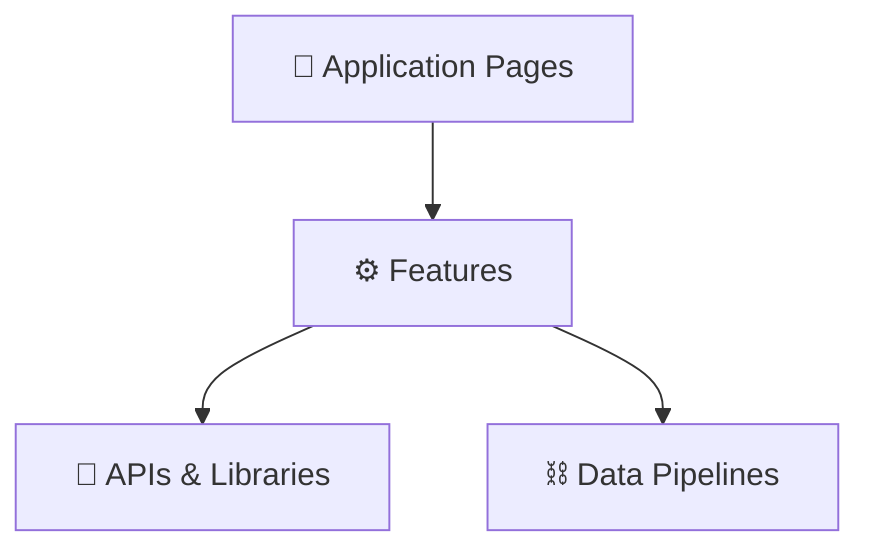

# ⚙️ MOC — Features

> The core functional capabilities of the DocLens AI application.

---

## Features Directory

### Reading & Ingestion

- [[PDF Viewer]] — Lazy-rendering PDF view engine, canvas rendering, memory manager.
- [[Document Management]] — Upload, metadata processing, thumbnails, IndexedDB storage, delete confirmation.
- [[Text Selection Toolbar]] — Floating contextual menu providing Copy, Translate, and Speak actions.

### AI Processing

- [[AI Translation]] — Output language settings, tone profiles, OpenRouter endpoint connections, streaming token parsing.
- [[Auto-Translate]] — Background execution parsing 3 pages ahead of current reading position.
- [[Per-Page Overrides]] — Custom configurations (model, tone, temperature, custom prompt payload editor) per page.
- [[API Key Management]] — Server key environment checks, client status badges, verification modal.

### Speech Synthesis

- [[Text-to-Speech]] — Dynamic TTS orchestration, sentence splitting, voice preferences.
- [[Piper Neural TTS]] — Local WASM-based neural engine, catalog downloads, ONNX caching.

### Diagnostics & Integration

- [[Memory Diagnostics]] — Real-time memory footprint diagnostics (Heap, Canvases, LocalStorage).
- [[Memory & Storage Audit]] — Comprehensive audit of memory hotspots and optimization strategies.
- [[Export System]] — Document and translation data exporter supporting Markdown and structured JSON.

---

## Technical Mapping

---

_Part of [[00 — MOC — Project]]_
