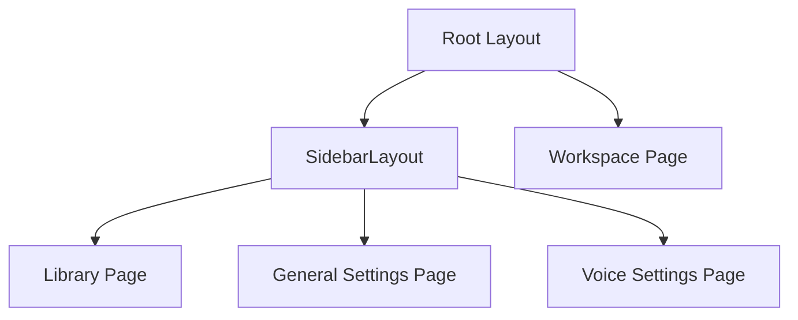

# 📄 MOC — Pages

> The four primary user-facing views of the DocLens AI application.

---

## Application Routes & Pages

| Page                      | Route             | Source File           | Purpose                                                  |
| ------------------------- | ----------------- | --------------------- | -------------------------------------------------------- |
| [[Library Page]]          | `/`               | `index.tsx`           | Landing experience, document upload, storage browsing    |
| [[Workspace Page]]        | `/doc/$id`        | `doc.$id.tsx`         | Main split-panel reader, AI translation, TTS playback    |
| [[General Settings Page]] | `/settings`       | `settings.tsx`        | Global AI configs, connection status, memory diagnostics |
| [[Voice Settings Page]]   | `/settings/voice` | `settings_.voice.tsx` | TTS engine toggle, Piper catalog, browser voice selector |

---

## Layout & Architecture

All pages (except the Workspace) are wrapped in the shared navigation shell:

- [[SidebarLayout]] — persistent navigation sidebar (Library, Settings, Voice Settings) and mobile drawer.

---

## Related MOCs

- [[MOC — Features]] — Features embedded within these pages
- [[MOC — Components]] — Specific UI components rendering these pages
- [[MOC — User Flows]] — User journeys connecting these pages

---

_Part of [[00 — MOC — Project]]_
