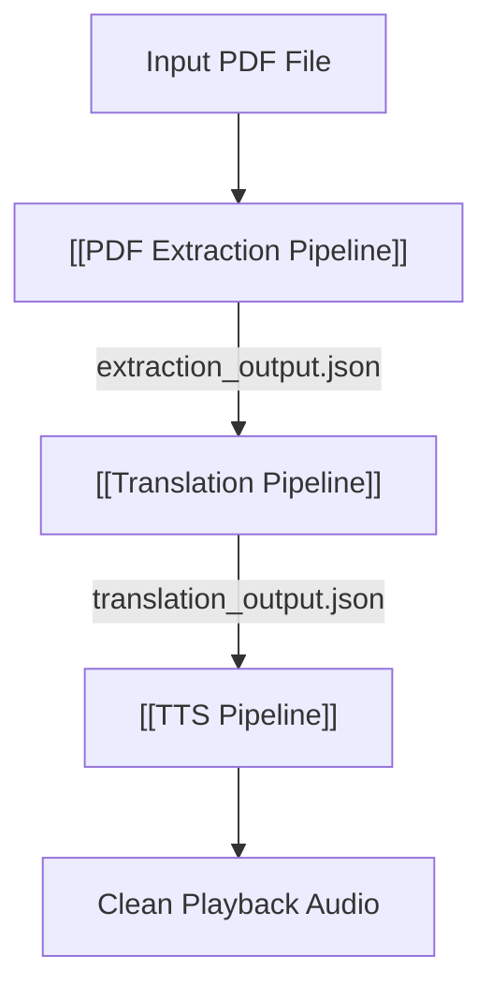

# ⛓️ MOC — Pipelines

> The three core processing pipelines that handle document digestion, translation, and speech generation in DocLens AI.

---

## Processing Pipelines

| Pipeline                    | Source Role                  | Hand-off Format           | Target Role               |
| --------------------------- | ---------------------------- | ------------------------- | ------------------------- |
| [[PDF Extraction Pipeline]] | [[Squad A — PDF Extraction]] | `extraction_output.json`  | [[Squad B — Translation]] |
| [[Translation Pipeline]]    | [[Squad B — Translation]]    | `translation_output.json` | [[Squad C — TTS]]         |
| [[TTS Pipeline]]            | [[Squad C — TTS]]            | Clean audio output chunks | Browser Player            |

---

## Data Flow Diagram

---

## Related MOCs

- [[MOC — User Flows]] — The user-facing experience of these pipelines
- [[MOC — Teams]] — Squads responsible for each pipeline
- [[MOC — Roles]] — Individual roles executing the pipeline tasks

---

_Part of [[00 — MOC — Project]]_
