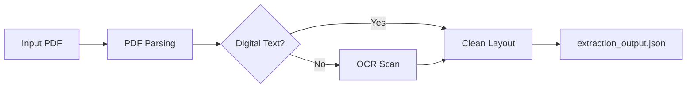

# PDF Extraction Pipeline

> The first stage of the document processing pipeline. Extracts text content from PDF binaries and structures it for translation.

---

## Pipeline Stages

---

## Detailed Steps

### 1. Ingestion & File Check

- Ingests uploaded PDF files.
- Checks layout orientation, size limits, security settings, and password protections.
- Team responsible: [[PDF Parsing Engineers]] (Depth 1).

### 2. Layout & Structure Extraction

- Processes digital text layers using [[PDF.js]].
- Detects document structure: headers, body paragraphs, list structures, footnotes, and multi-column formats.
- Team responsible: [[PDF Parsing Engineers]] (Depth 1).

### 3. OCR Image Processing

- Scans low-confidence or image-only pages.
- Pre-processes page images (binarization, contrast adjustments, rotation corrections).
- Executes OCR parsing using Tesseract, Google Vision, or AWS Textract to extract text blocks.
- Team responsible: [[OCR Specialists]] (Depth 1).

### 4. Text Normalization & Layout Formatting

- Merges extracted text layers and corrects common formatting issues.
- Fixes ligature styling bugs, hyphenations, line breaks, header repetition, page numbering noise, and encoding errors.
- Runs quality checks (e.g., character error rate checks) and routes low-confidence pages for review.
- Team responsible: [[Text Cleaning Engineers]] (Depth 2).

---

## Output Contract

Generates `extraction_output.json`:

- Contains page details, text block lists, coordinate mappings, layout metrics, and extraction confidence flags.
- Pushed to the [[Translation Pipeline]] input queue.

---

## Relationships

- **Team Owner:** [[Squad A — PDF Extraction]].
- **Core Technology:** [[PDF.js]].

---

_Part of [[MOC — Pipelines]]_
