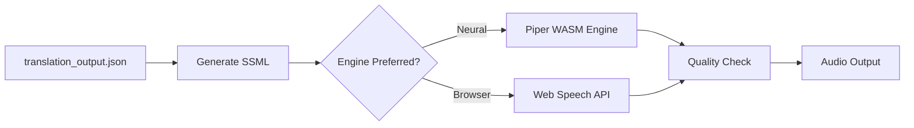

# TTS Pipeline

> The final stage of the document processing pipeline. Synthesizes translated text into spoken audio.

---

## Pipeline Stages

---

## Detailed Steps

### 1. SSML Preparation
- Formats translation segments into SSML blocks to configure pronunciation parameters.
- Inserts pauses for punctuation, emphasizes headings, and formats abbreviations.
- Team responsible: [[TTS Engine Engineers]].

### 2. Voice Generation
- Selects the target voice profile.
- Processes text using the preferred engine:
  - **Local WASM (Piper):** WebAssembly-based offline synthesis.
  - **Browser (Web Speech API):** Native browser speech synthesis fallback.
- Team responsible: [[TTS Engine Engineers]].

### 3. Sound Quality Review
- Monitors synthesized audio for issues like volume clipping or unexpected silence gaps.
- Verifies pronunciation accuracy for key terms and checks text-to-audio sync times.
- Team responsible: [[Audio QA]].

---

## Output Contract

Outputs clean audio streams:
- Renders audio files (MP3/WAV/OGG) mapped to corresponding text chunks.
- Coordinates sentence highlighting with speech playback in the browser.

---

## Relationships

- **Team Owner:** [[Squad C — TTS]].
- **Core Technologies:** [[Piper WASM Engine]], [[Web Speech API]].

---

*Part of [[MOC — Pipelines]]*
