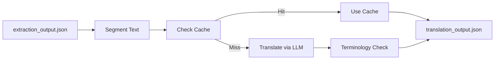

# Translation Pipeline

> The second stage of the document processing pipeline. Translates or explains extracted page text.

---

## Pipeline Stages

---

## Detailed Steps

### 1. NLP Text Segmentation
- Receives the clean layout structure.
- Splits text blocks into sentence segments to prepare for translation.
- Preserves structure tags like headings, bullet lists, and formatting markers.
- Team responsible: [[NLP Translation Engineers]].

### 2. Translation & Summarization
- Automatically detects the source language.
- Calls the [[OpenRouter API]] to translate or explain content into the target language.
- Applies contextual reference parameters, passing trailing summaries of the previous page for context.
- Team responsible: [[NLP Translation Engineers]].

### 3. Terminology & Glossary Matching
- Checks translated text against customized terminology lists and style rules.
- Integrates client glossaries and handles translation memory lookups.
- Team responsible: [[Terminology Management]].

### 4. Quality Review Check
- Runs automated quality metrics (BLEU, COMET) on translations.
- Identifies low-scoring translations and routes them for human review.
- Team responsible: [[Language QA]].

---

## Output Contract

Generates `translation_output.json`:
- Contains source segments, target translations, terminology tags, page IDs, and model hashes.
- Pushed to the [[TTS Pipeline]] input queue.

---

## Relationships

- **Team Owner:** [[Squad B — Translation]].
- **Core Technology:** [[OpenRouter API]].

---

*Part of [[MOC — Pipelines]]*
