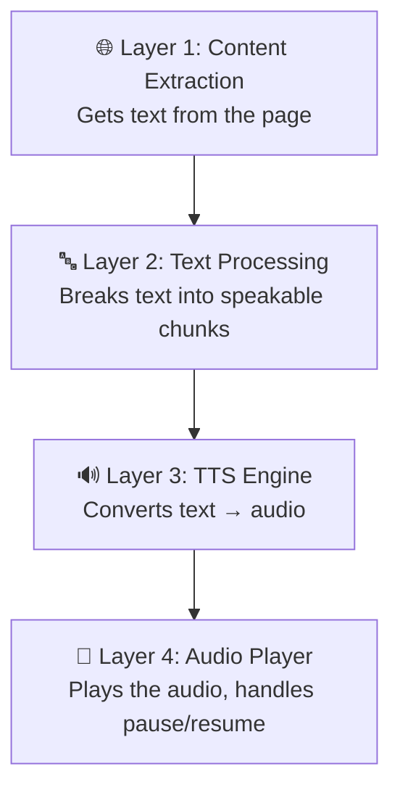
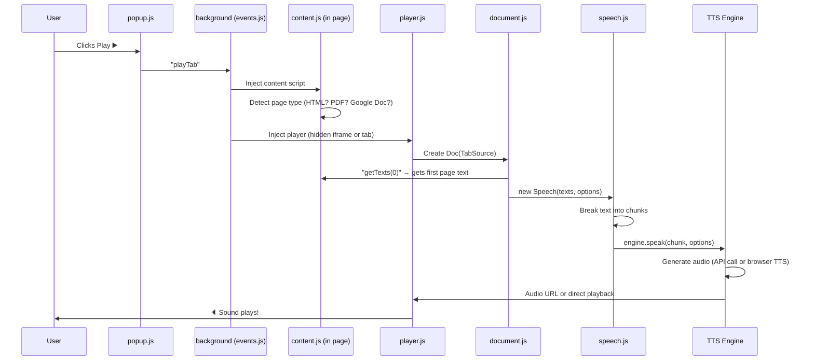
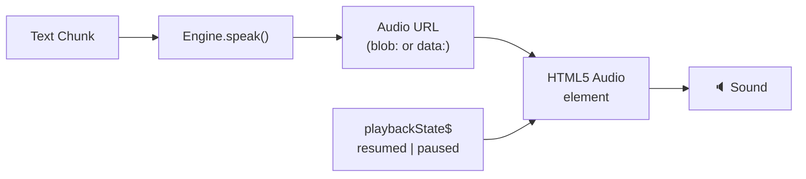

# Read Aloud Extension — Complete Architecture Analysis & DocLens Integration Strategy

## Table of Contents

1. [High-Level Overview](#1-high-level-overview)
2. [How Every Piece Works (Beginner-Friendly)](#2-how-every-piece-works)
3. [The TTS Engine System — The Heart You Want](#3-the-tts-engine-system)
4. [The FREE Engines (No API Key Needed)](#4-the-free-engines)
5. [The PAID Engines (Need API Keys)](#5-the-paid-engines)
6. [Text Chunking — Why It Matters](#6-text-chunking)
7. [Audio Playback Pipeline](#7-audio-playback-pipeline)
8. [Step-by-Step: How to Fork This Into DocLens](#8-forking-into-doclens)
9. [Recommended Strategy: Best Quality for Free](#9-recommended-strategy)

---

## 1. High-Level Overview

Read Aloud is a Chrome/Firefox extension that reads web pages aloud. Think of it as a **4-layer sandwich**:



### File Map (What Each File Does)

| File                  | Role                                                               | Analogy                  |
| --------------------- | ------------------------------------------------------------------ | ------------------------ |
| `background.js`       | Entry point, loads everything                                      | The "power button"       |
| `events.js`           | Handles keyboard shortcuts, context menus, orchestrates everything | The "traffic controller" |
| `document.js`         | Gets text from the page, manages reading session                   | The "librarian"          |
| `content.js`          | Injected into web pages to extract text                            | The "reader"             |
| `speech.js`           | Takes text, picks engine, manages playlist                         | The "DJ"                 |
| `tts-engines.js`      | All 12 TTS engine implementations                                  | The "voice actors"       |
| `player.js`           | Manages audio playback, UI, iframes                                | The "music player"       |
| `defaults.js`         | Settings, helpers, audio playback utilities                        | The "toolbox"            |
| `messaging.js`        | Communication between components                                   | The "telephone system"   |
| `google-translate.js` | Special engine: hacks Google Translate for free TTS                | The "clever hack"        |

---

## 2. How Every Piece Works

### 2.1 The Flow When You Click "Play"



### 2.2 The Component Communication

The extension uses a **message bus pattern**. Every component registers itself:

```
┌─────────────┐     brapi.runtime.sendMessage()     ┌─────────────┐
│ Service      │ ◄──────────────────────────────────► │ Player      │
│ Worker (BG)  │     dest: "serviceWorker"            │ (player.js) │
│              │     dest: "player"                   │             │
└──────┬───────┘                                      └──────┬──────┘
       │                                                      │
       │ brapi.tabs.sendMessage()                             │
       │                                                      │
┌──────▼───────┐                                              │
│ Content      │ ◄────────────────────────────────────────────┘
│ Script       │     dest: "contentScript"
│ (content.js) │
└──────────────┘
```

> [!NOTE]
> **For your DocLens app**: You won't need this messaging system! In a web app, all your code runs in one place. This complexity exists only because browser extensions are split across isolated contexts.

---

## 3. The TTS Engine System

This is the core of what you want. The extension supports **12 different TTS engines**, each wrapped in a common interface:

```javascript
// Every engine has this shape:
interface TtsEngine {
  speak(text, options, playbackState$)  // Convert text to speech
  getVoices()                           // List available voices
  prefetch?(text, options)              // Pre-load next chunk (optional)
  stop?()                               // Stop playback (legacy engines)
  pause?()                              // Pause (legacy engines)
  resume?()                             // Resume (legacy engines)
}
```

### Engine Selection Logic ([speech.js:27-45](file:///home/sanskar/Desktop/Anuwad%20Doc%20Lence/read-aloud/js/speech.js#L27-L45))

```javascript
function pickEngine() {
  if (isPiperVoice(options.voice)) return piperTtsEngine; // ✅ FREE, Local
  if (isSupertonicVoice(options.voice)) return supertonicTtsEngine; // ✅ FREE, Local
  if (isAzure(options.voice)) return azureTtsEngine; // 💰 Paid
  if (isOpenai(options.voice)) return openaiTtsEngine; // 💰 Paid
  if (isUseMyPhone(options.voice)) return phoneTtsEngine; // ✅ FREE (uses phone)
  if (isGoogleTranslate(options.voice)) return googleTranslateTtsEngine; // ✅ FREE!
  if (isAmazonPolly(options.voice)) return amazonPollyTtsEngine; // 💰 Paid
  if (isGoogleWavenet(options.voice)) return googleWavenetTtsEngine; // 💰 Paid (free tier)
  if (isIbmWatson(options.voice)) return ibmWatsonTtsEngine; // 💰 Paid
  if (isPremiumVoice(options.voice)) return premiumTtsEngine; // 💰 Paid
  if (isGoogleNative(options.voice)) return browserTtsEngine; // ✅ FREE
  return browserTtsEngine; // ✅ FREE (fallback)
}
```

---

## 4. The FREE Engines (No API Key Needed)

### 4.1 🌟 Browser Web Speech API (`WebSpeechEngine`) — YOUR BEST STARTING POINT

**How it works**: Uses the browser's built-in `SpeechSynthesisUtterance` API. Every modern browser has this.

```javascript
// Simplified version of what the extension does:
function speak(text) {
  const utterance = new SpeechSynthesisUtterance();
  utterance.text = text;
  utterance.lang = "en-US";
  utterance.rate = 1.0; // 0.1 to 10
  utterance.pitch = 1.0; // 0 to 2
  utterance.volume = 1.0; // 0 to 1

  // Pick a voice
  const voices = speechSynthesis.getVoices();
  utterance.voice = voices.find((v) => v.name.includes("Google"));

  utterance.onstart = () => console.log("Started speaking");
  utterance.onend = () => console.log("Finished speaking");

  speechSynthesis.speak(utterance);
}
```

**Quality**: ⭐⭐⭐ (decent, depends on OS/browser voices)  
**Cost**: FREE  
**Languages**: 20-40+ depending on browser  
**Limitation**: Quality varies by OS. Chrome has good Google voices. Firefox uses OS voices.

---

### 4.2 🌟 Google Translate TTS (`GoogleTranslateTtsEngine`) — FREE & GOOD QUALITY

**How it works**: The extension reverse-engineers Google Translate's internal TTS API. It:

1. Fetches the Google Translate page to get authentication tokens (`WIZ_global_data`)
2. Uses those tokens to call an internal `batchExecute` RPC endpoint
3. Gets back base64-encoded MP3 audio

**The clever trick** ([google-translate.js](file:///home/sanskar/Desktop/Anuwad%20Doc%20Lence/read-aloud/js/google-translate.js)):

```javascript
// 1. Scrape auth tokens from translate.google.com
async function fetchWizGlobalData(url) {
  const html = await fetch(url).then((r) => r.text());
  // Extract: f.sid, bl, at tokens from WIZ_global_data
  return { "f.sid": "...", bl: "...", at: "..." };
}

// 2. Call the internal TTS endpoint
async function googleTranslateSynthesizeSpeech(text, lang) {
  const payload = await batchExecute("jQ1olc", [text, lang, null]);
  return "data:audio/mpeg;base64," + payload[0];
  // Returns a data URL you can play directly!
}
```

**Quality**: ⭐⭐⭐⭐ (good, natural sounding)  
**Cost**: FREE  
**Languages**: 57 languages  
**Limitation**: 200 chars per request (extension splits text). May break if Google changes their internal API. **Cannot be used in production commercially** — violates Google TOS.

> [!WARNING]
> **For DocLens**: This approach is fragile and against Google's Terms of Service. It's a hack. Google can change their internal API at any time and break it. Not recommended for a production app.

---

### 4.3 🌟 Piper TTS (`PiperTtsEngine`) — FREE, LOCAL, HIGH QUALITY

**How it works**: Piper is an open-source neural TTS engine that runs entirely in the browser using WebAssembly (WASM). The extension loads it in an iframe from `piper.ttstool.com`.

```javascript
// The extension creates an iframe:
function createPiperFrame() {
  const f = document.createElement("iframe");
  f.src = "https://piper.ttstool.com/";
  f.allow = "cross-origin-isolated";
  document.body.appendChild(f);
}

// Communication happens via window.postMessage()
// The iframe hosts the WASM model and does the synthesis
```

**Quality**: ⭐⭐⭐⭐⭐ (excellent, neural voices)  
**Cost**: FREE (open source!)  
**Languages**: 30+ languages  
**Key fact**: Piper models run entirely client-side. No server needed!

> [!IMPORTANT]
> **For DocLens**: Piper is your BEST option for high-quality free TTS. You can self-host the WASM runtime and models. See [Section 8](#8-forking-into-doclens).

---

### 4.4 Supertonic TTS (`SupertonicTtsEngine`)

Same architecture as Piper — runs in an iframe via `supertonic.ttstool.com`. Also WebAssembly-based, neural TTS.

---

## 5. The PAID Engines (Need API Keys)

| Engine                     | Provider      | Quality    | Free Tier?                        |
| -------------------------- | ------------- | ---------- | --------------------------------- |
| Amazon Polly               | AWS           | ⭐⭐⭐⭐⭐ | 5M chars/month free for 12 months |
| Google Wavenet/Neural2     | Google Cloud  | ⭐⭐⭐⭐⭐ | 1M chars/month free (Standard)    |
| Azure TTS                  | Microsoft     | ⭐⭐⭐⭐⭐ | 500K chars/month free             |
| OpenAI TTS                 | OpenAI        | ⭐⭐⭐⭐⭐ | No free tier                      |
| IBM Watson                 | IBM           | ⭐⭐⭐⭐   | 10K chars/month free              |
| Premium (ReadAloud hosted) | readaloud.app | ⭐⭐⭐⭐   | Limited free                      |

All paid engines follow the same pattern:

```javascript
// Simplified flow for ALL cloud TTS engines:
async function speak(text, options) {
  // 1. Build the API request
  const audioUrl = await getAudioUrl(text, options);

  // 2. Play the audio
  return playAudio(audioUrl, options, playbackState$);
}

async function getAudioUrl(text, options) {
  // Check cache first (saves API calls!)
  return cache.fetchCached(
    cacheKey,
    async () => {
      // Make API call → get audio blob → create blob URL
      const response = await fetch(apiEndpoint, { method: "POST", body: ... });
      const blob = await response.blob();
      return URL.createObjectURL(blob);
    },
    blobUrl => URL.revokeObjectURL(blobUrl)  // cleanup
  );
}
```

---

## 6. Text Chunking — Why It Matters

TTS engines have character limits. You can't send an entire page of text at once. The extension has a sophisticated text-breaking system ([speech.js:47-59](file:///home/sanskar/Desktop/Anuwad%20Doc%20Lence/read-aloud/js/speech.js#L47-L59)):

```
Full page text
  │
  ▼ getParagraphs() — split on double newlines
  │
  ▼ getSentences() — split on . ! ?
  │
  ▼ getPhrases() — split on , ; : —
  │
  ▼ getWords() — split on spaces
  │
  ▼ Recombine into optimal-sized chunks (200-750 chars)
```

### Chunk sizes by engine:

| Engine                      | Max Chunk Size | Strategy                         |
| --------------------------- | -------------- | -------------------------------- |
| Google Translate            | 200 chars      | `CharBreaker(200)`               |
| Browser TTS (Google Native) | ~36 words      | `WordBreaker(36)`                |
| Piper / Supertonic          | Entire text    | No breaking (handles internally) |
| All other cloud engines     | 750 chars      | `CharBreaker(750)`               |

### The Punctuator System

Two punctuators handle different languages:

- **LatinPunctuator**: For English, French, Spanish, etc. Splits on periods, commas, handles abbreviations (Dr., Mr., etc.)
- **EastAsianPunctuator**: For Chinese, Japanese, Korean. Splits on 。！ and other CJK punctuation.

---

## 7. Audio Playback Pipeline

The extension has a reactive audio pipeline using RxJS:



### The `playAudioHere` function ([defaults.js:789-842](file:///home/sanskar/Desktop/Anuwad%20Doc%20Lence/read-aloud/js/defaults.js#L789-L842))

This is the actual audio player. Simplified:

```javascript
function playAudioHere(urlPromise, options, playbackState$) {
  const audio = new Audio();

  // 1. Set playback rate and volume
  audio.defaultPlaybackRate = options.rate;
  audio.volume = options.volume;

  // 2. Load the audio
  audio.src = await urlPromise;

  // 3. React to play/pause commands
  playbackState$.subscribe(state => {
    if (state === "resumed") audio.play();
    else audio.pause();
  });

  // 4. Emit events
  audio.onended = () => emit({ type: "end" });
}
```

### Audio Caching System ([tts-engines.js:16-31](file:///home/sanskar/Desktop/Anuwad%20Doc%20Lence/read-aloud/js/tts-engines.js#L16-L31))

The extension caches the last 5 audio chunks to avoid re-fetching:

```javascript
const cache = {
  entries: new Map(),
  maxEntries: 5,
  async fetchCached(key, fetchFn, destroyFn) {
    const entry = this.entries.get(key);
    if (entry) return entry.value; // Cache hit!
    const value = await fetchFn(); // Cache miss, fetch
    this.entries.set(key, { value, destroyFn });
    // Evict oldest if over limit
    while (this.entries.size > this.maxEntries) {
      const [oldKey, oldest] = this.entries.entries().next().value;
      oldest.destroyFn?.(oldest.value); // Clean up blob URL
      this.entries.delete(oldKey);
    }
    return value;
  },
};
```

---

## 8. Forking Into DocLens — Step-by-Step

Here's how to add high-quality "listen to result" functionality to DocLens:

### Step 1: Create the TTS Manager Module

Create a single file `tts-manager.js` that wraps all free TTS options:

```javascript
// tts-manager.js - Your DocLens TTS Module
class TTSManager {
  constructor() {
    this.currentUtterance = null;
    this.isPlaying = false;
    this.isPaused = false;
    this.onStateChange = null; // callback
  }

  // Get available voices
  getVoices() {
    return new Promise((resolve) => {
      let voices = speechSynthesis.getVoices();
      if (voices.length) return resolve(voices);
      speechSynthesis.onvoiceschanged = () => {
        resolve(speechSynthesis.getVoices());
      };
    });
  }

  // Main speak method
  async speak(text, options = {}) {
    this.stop(); // Stop any current playback

    const chunks = this.breakTextIntoChunks(text, 750);
    this.isPlaying = true;
    this.isPaused = false;
    this.notifyState("PLAYING");

    for (let i = 0; i < chunks.length; i++) {
      if (!this.isPlaying) break;
      await this.speakChunk(chunks[i], options);
    }

    this.isPlaying = false;
    this.notifyState("STOPPED");
  }

  speakChunk(text, options) {
    return new Promise((resolve, reject) => {
      const utterance = new SpeechSynthesisUtterance(text);
      utterance.rate = options.rate || 1.0;
      utterance.pitch = options.pitch || 1.0;
      utterance.volume = options.volume || 1.0;
      if (options.voice) utterance.voice = options.voice;
      if (options.lang) utterance.lang = options.lang;

      utterance.onend = resolve;
      utterance.onerror = (e) => {
        if (e.error !== "canceled" && e.error !== "interrupted") {
          reject(new Error(e.error));
        } else {
          resolve();
        }
      };

      this.currentUtterance = utterance;
      speechSynthesis.speak(utterance);
    });
  }

  pause() {
    speechSynthesis.pause();
    this.isPaused = true;
    this.notifyState("PAUSED");
  }

  resume() {
    speechSynthesis.resume();
    this.isPaused = false;
    this.notifyState("PLAYING");
  }

  stop() {
    speechSynthesis.cancel();
    this.isPlaying = false;
    this.isPaused = false;
    this.notifyState("STOPPED");
  }

  // Text chunking (borrowed from Read Aloud's approach)
  breakTextIntoChunks(text, maxChars = 750) {
    const paragraphs = text.split(/(?:\r?\n\s*){2,}/);
    const chunks = [];

    for (const para of paragraphs) {
      if (para.length <= maxChars) {
        chunks.push(para);
      } else {
        // Split on sentence boundaries
        const sentences = para.split(/([.!?]+[\s\u200b]+)/);
        let current = "";
        for (let i = 0; i < sentences.length; i += 2) {
          const sentence = sentences[i] + (sentences[i + 1] || "");
          if ((current + sentence).length > maxChars && current) {
            chunks.push(current.trim());
            current = sentence;
          } else {
            current += sentence;
          }
        }
        if (current.trim()) chunks.push(current.trim());
      }
    }

    return chunks.filter((c) => c.length > 0);
  }

  notifyState(state) {
    if (this.onStateChange) this.onStateChange(state);
  }
}
```

### Step 2: Add Piper WASM for Premium Quality (Still Free!)

For neural-quality voices without any API costs, use Piper directly:

```javascript
// piper-tts.js - Local neural TTS
class PiperTTS {
  constructor() {
    this.worker = null;
    this.modelLoaded = false;
  }

  async init() {
    // Load Piper WASM (you host these files yourself)
    this.worker = new Worker("/js/piper-worker.js");
    // Load a voice model (typically 15-60 MB, cached by browser)
    await this.loadModel("en_US-amy-medium");
    this.modelLoaded = true;
  }

  async synthesize(text) {
    return new Promise((resolve, reject) => {
      this.worker.postMessage({ type: "synthesize", text });
      this.worker.onmessage = (e) => {
        if (e.data.type === "audio") {
          const blob = new Blob([e.data.audio], { type: "audio/wav" });
          resolve(URL.createObjectURL(blob));
        }
      };
    });
  }

  async speak(text, options = {}) {
    const audioUrl = await this.synthesize(text);
    const audio = new Audio(audioUrl);
    audio.playbackRate = options.rate || 1.0;
    audio.volume = options.volume || 1.0;

    return new Promise((resolve) => {
      audio.onended = () => {
        URL.revokeObjectURL(audioUrl);
        resolve();
      };
      audio.play();
    });
  }
}
```

### Step 3: Integrate Into Your DocLens Page Result Panel

```javascript
// In your DocLens page result component:
const tts = new TTSManager();

// "Listen" button click handler
document.getElementById("listen-btn").addEventListener("click", async () => {
  const resultText = document.getElementById("ai-result").textContent;

  // Get the best available voice
  const voices = await tts.getVoices();
  const preferredVoice =
    voices.find((v) => v.name.includes("Google") && v.lang.startsWith("en")) || voices[0];

  await tts.speak(resultText, {
    voice: preferredVoice,
    rate: 1.0,
    pitch: 1.0,
    volume: 1.0,
    lang: "en-US",
  });
});

// Pause/Resume
document.getElementById("pause-btn").addEventListener("click", () => {
  if (tts.isPaused) tts.resume();
  else tts.pause();
});

// Stop
document.getElementById("stop-btn").addEventListener("click", () => {
  tts.stop();
});
```

### Step 4: Add UI Controls

```html
<div class="tts-controls">
  <button id="listen-btn" title="Listen">🔊 Listen</button>
  <button id="pause-btn" title="Pause/Resume">⏸️</button>
  <button id="stop-btn" title="Stop">⏹️</button>

  <label
    >Speed:
    <input type="range" id="rate" min="0.5" max="2" step="0.1" value="1" />
  </label>

  <select id="voice-select">
    <!-- Populated dynamically -->
  </select>
</div>
```

---

## 9. Recommended Strategy — Best Quality for Free

Here's my recommended **tiered approach** for DocLens:

### Tier 1: Web Speech API (Simplest, works immediately)

- **What**: Browser's built-in `speechSynthesis` API
- **Quality**: Good (Chrome has Google voices built-in)
- **Effort**: 1-2 hours to implement
- **Cost**: $0 forever
- **Code**: Just the `TTSManager` class from Step 1 above

### Tier 2: Piper WASM (Best free neural quality)

- **What**: Open-source neural TTS running in browser via WebAssembly
- **Quality**: Excellent (comparable to paid services)
- **Effort**: 1-2 days to set up
- **Cost**: $0 (you self-host the ~30MB WASM files + voice models)
- **GitHub**: [rhasspy/piper](https://github.com/rhasspy/piper)
- **Web demo**: [piper.ttstool.com](https://piper.ttstool.com)

### Tier 3: Cloud APIs with free tiers (Optional, highest quality)

- **Google Cloud TTS**: 1M chars/month free (Standard voices)
- **Azure TTS**: 500K chars/month free
- **Amazon Polly**: 5M chars/month free (first 12 months)

> [!TIP]
> **My recommendation**: Start with **Tier 1 (Web Speech API)** for a working prototype in under 2 hours. Then upgrade to **Tier 2 (Piper WASM)** for production-quality voices. You don't need Tier 3 unless you need specific premium voices.

### What NOT to copy from Read Aloud:

1. ❌ The Google Translate hack — fragile and against TOS
2. ❌ The extension messaging system — not needed in a web app
3. ❌ The RxJS reactive pipeline — overkill for your use case
4. ❌ The Chrome `tts` API — only works in extensions

### What TO copy from Read Aloud:

1. ✅ The text chunking algorithm (paragraph → sentence → phrase splitting)
2. ✅ The audio caching pattern (cache last N chunks)
3. ✅ The playlist pattern (track current chunk index, forward/rewind)
4. ✅ The voice selection logic (prefer offline → native → cloud)
5. ✅ The language detection approach (detect before speaking)

---

## Summary

| Aspect              | Read Aloud Approach                   | Your DocLens Approach                       |
| ------------------- | ------------------------------------- | ------------------------------------------- |
| **Architecture**    | Extension (multi-context, messaging)  | Web app (single context, simple)            |
| **TTS Engine**      | 12 engines, complex routing           | Start with Web Speech API, upgrade to Piper |
| **Text Breaking**   | Sophisticated CharBreaker/WordBreaker | Copy the CharBreaker algorithm              |
| **Audio Playback**  | RxJS Observables, offscreen documents | Simple HTML5 Audio + Promises               |
| **Voice Selection** | Auto-detect language + voice matching | Let user pick or auto-detect                |
| **Caching**         | In-memory Map, 5 entries              | Same pattern, simple Map cache              |
| **Cost**            | Free (with hacks) or paid             | Free (Web Speech API + Piper)               |

> [!IMPORTANT]
> **Bottom line**: You don't need to fork the entire extension. Extract just 3 things: **(1)** the text chunking logic, **(2)** the playlist/playback management pattern, and **(3)** either use the Web Speech API directly or integrate Piper WASM. This gives you the same quality with 10% of the complexity.
