# End-to-End Pipeline

> The complete data flow from PDF file input to translated audio output.

---

## Pipeline Overview

```mermaid
flowchart LR
    subgraph INPUT
        A[PDF File]
    end
    
    subgraph EXTRACTION["[[PDF Extraction Pipeline]]"]
        B[PDF.js parsing]
        C[Text + structure extraction]
        D[Column detection & cleanup]
    end
    
    subgraph TRANSLATION["[[Translation Pipeline]]"]
        E[Build API payload]
        F[Stream to OpenRouter]
        G[Receive AI result]
    end
    
    subgraph TTS["[[TTS Pipeline]]"]
        H[Split into sentences]
        I[Piper WASM synthesis]
        J[Audio playback + highlighting]
    end
    
    A --> B --> C --> D
    D -->|"extraction stored in IDB"| E --> F --> G
    G -->|"translation stored in IDB"| H --> I --> J
```

---

## Stage Details

### Stage 1: PDF Extraction
- **Input:** PDF binary from [[IndexedDB Storage]]
- **Process:** [[PDF.js]] renders each page, extracts text content with position data
- **Enhancements:** Column detection (single vs multi-column), garbage ratio filtering
- **Output:** Per-page text + metadata stored in IndexedDB
- **Team:** [[Squad A — PDF Extraction]]

### Stage 2: AI Translation
- **Input:** Extracted page text + user settings (mode, language, style, temperature)
- **Process:** Payload built via `buildPagePayload()`, streamed via [[OpenRouter API]]
- **Memory:** Optional previous-page context via `memoryExcerpt()`
- **Output:** Translated/explained text stored in IndexedDB with settings hash
- **Team:** [[Squad B — Translation]]

### Stage 3: Text-to-Speech
- **Input:** Translated text from Stage 2
- **Process:** Text split into sentence chunks, each synthesized by [[Piper WASM Engine]] or [[Web Speech API]]
- **Output:** Real-time audio playback with sentence-level highlighting
- **Team:** [[Squad C — TTS]]

---

## Data Contracts

| Handoff | Format | Key Fields |
|---------|--------|------------|
| Upload → Extraction | PDF binary (ArrayBuffer) | Stored as blob in IDB |
| Extraction → Translation | `PageData` record | `text`, `columns`, `pageNumber` |
| Translation → TTS | `PageAi` record | `result` (string), `status`, `settingsHash` |
| Translation → Storage | Settings hash | `modelId`, `mode`, `language`, `style`, `temperature`, `memory` |

---

## Cross-References

### Team Ownership
- [[Squad A — PDF Extraction]] owns Stage 1
- [[Squad B — Translation]] owns Stage 2
- [[Squad C — TTS]] owns Stage 3
- [[Shared Services]] provides infrastructure for all stages

### Feature Mapping
- Stage 1: [[PDF Viewer]], [[Document Management]]
- Stage 2: [[AI Translation]], [[Auto-Translate]], [[Per-Page Overrides]]
- Stage 3: [[Text-to-Speech]], [[Piper Neural TTS]]

---

## Related

- [[PDF to Translation Workflow]] — User perspective of Stage 1→2
- [[Translation to TTS Workflow]] — User perspective of Stage 2→3
- [[MOC — Pipelines]] — Pipeline details
- [[What is DocLens AI]] — Product context

---

*Part of [[MOC — User Flows]]*
