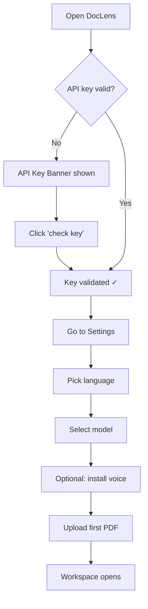

# First Time Setup

> The onboarding flow a new user follows to get DocLens AI operational.

---

## Prerequisites

- A running DocLens instance with `OPENROUTER_API_KEY` set as an environment variable on the server

---

## Steps

### 1. Land on [[Library Page]]
- User sees the hero section: "Intelligence Library"
- The [[API Key Management|API Key Banner]] appears if the key isn't validated yet

### 2. Verify API Key
- Click the banner's "check key" button → [[ApiKeyModal]] opens
- The modal calls the server to validate the key
- On success: [[API Key Management|API Key Status Badge]] turns green ("connected")
- Related component: [[ApiKeyModal]]

### 3. Configure Language
- Navigate to [[General Settings Page]]
- Select output language via preset chips (हिंदी, English, Spanish, etc.) or type a custom language
- Language persists to `localStorage` immediately

### 4. Select AI Model
- On the same [[General Settings Page]], scroll to Model Selection
- Default tab: "free" — shows zero-cost models for experimentation
- Click a model card to select it
- Related feature: [[AI Translation]]

### 5. (Optional) Install a Voice
- Navigate to [[Voice Settings Page]]
- Browse the Piper catalog → install a neural voice for the selected language
- Related feature: [[Piper Neural TTS]]

### 6. Upload First Document
- Return to [[Library Page]]
- Drag a PDF onto the [[Dropzone]] or click to browse
- Document is stored in [[IndexedDB Storage]] and user is auto-navigated to the [[Workspace Page]]

---

## Flow Diagram

---

## Related

- [[Upload and Manage Documents]] — Next flow after setup
- [[API Key Management]] — Feature detail
- [[General Settings Page]] — Where configuration happens
- [[Voice Settings Page]] — Voice setup

---

*Part of [[MOC — User Flows]]*
