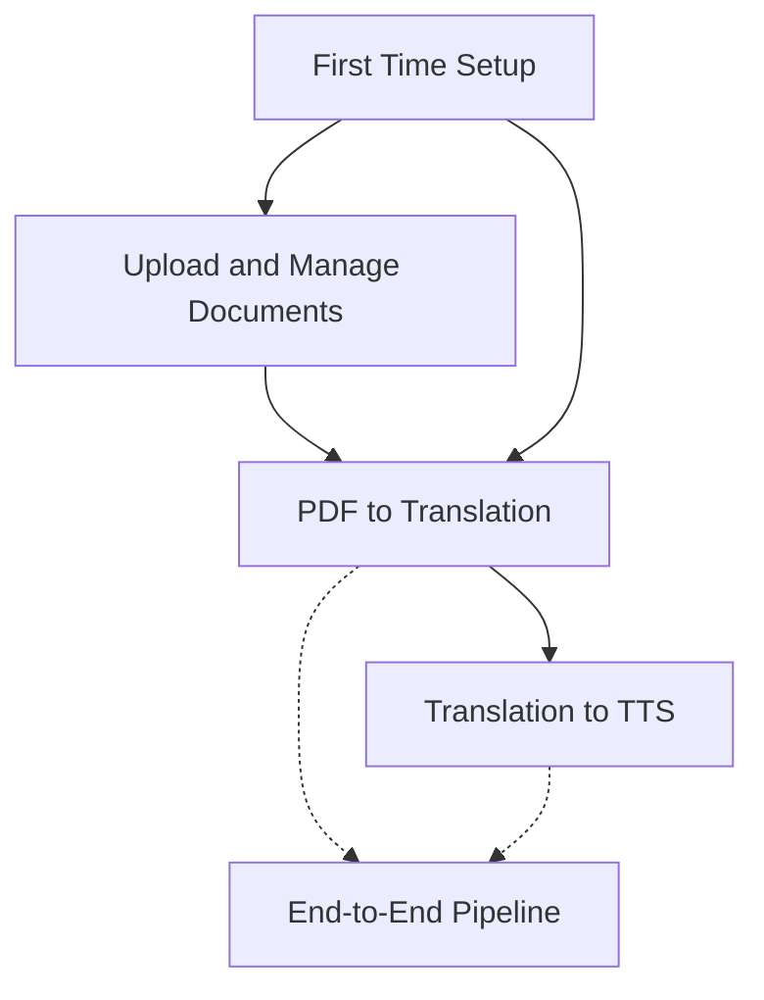

# 🔄 MOC — User Flows

> How users accomplish tasks in DocLens AI, from first launch to daily usage.

---

## Flows

| Flow                            | Description                                              |
| ------------------------------- | -------------------------------------------------------- |
| [[First Time Setup]]            | API key verification → language selection → model choice |
| [[Upload and Manage Documents]] | Drag-and-drop upload → library browsing → deletion       |
| [[PDF to Translation Workflow]] | Open document → extract text → translate pages           |
| [[Translation to TTS Workflow]] | AI result → voice setup → playback with highlighting     |
| [[End-to-End Pipeline]]         | Complete data flow: PDF file → translated audio          |

---

## Flow Relationships

---

## Related MOCs

- [[MOC — Pages]] — Where flows happen
- [[MOC — Features]] — Features that power flows
- [[MOC — Pipelines]] — Technical pipeline behind the flows

---

_Part of [[00 — MOC — Project]]_
