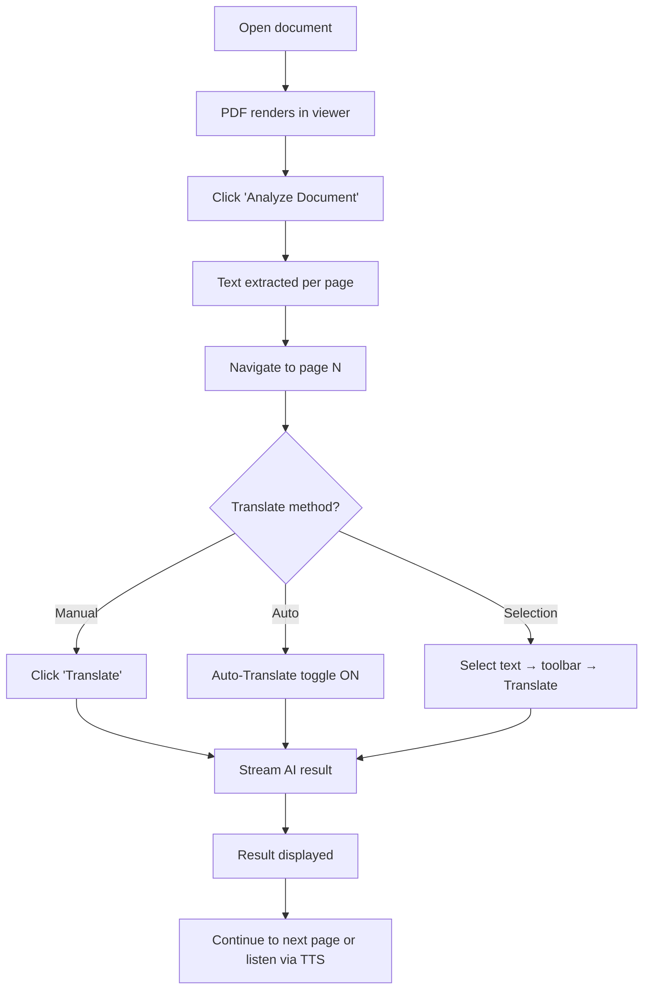

# PDF to Translation Workflow

> The core workflow: from opening a PDF to getting AI-translated results.

---

## Steps

### 1. Open Document

- Click a [[DocumentCard]] on the [[Library Page]] → navigates to [[Workspace Page]]
- PDF binary loaded from [[IndexedDB Storage]]
- [[PdfViewer]] renders the first visible pages via canvas

### 2. Analyze / Extract Text

- Click "Analyze Document" button in the header
- [[PDF Extraction Pipeline]] runs: reads each page's text content, detects column layout, computes garbage ratio
- Progress shown as "page N/M" in the header
- Results stored per-page in [[IndexedDB Storage]]

### 3. Navigate Pages

- Use ‹/› buttons or the page dropdown in the header
- URL syncs: `?page=N`
- [[PdfViewer]] scrolls to the selected page
- Right panel's [[PageWorkstation]] loads the corresponding page card

### 4. Translate a Page

- Click the green "Translate" button (label changes based on mode: Translate/Explain/Summarize)
- [[AI Translation]] streams the response from [[OpenRouter API]]
- Result appears in real-time with 150ms debounced flushing
- On completion: stored in [[IndexedDB Storage]] with a settings hash

### 5. (Optional) Auto-Translate

- Toggle "Auto-Translate" in the toolbar
- [[Auto-Translate]] pre-processes the next 3 pages in the background
- Re-triggers on every page navigation
- Feature: [[Auto-Translate]]

### 6. (Optional) Translate Selected Text

- Select text in the [[PdfViewer]]
- [[Text Selection Toolbar]] appears with Copy / Translate / Speak buttons
- "Translate" sends only the selected text (not full page) to [[AI Translation]]

### 7. (Optional) Per-Page Overrides

- Click ⚙ gear on the page card
- Adjust mode, language, style, model, temperature, memory per-page
- Feature: [[Per-Page Overrides]]

---

## Flow Diagram

---

## Related

- [[Workspace Page]] — Where this flow happens
- [[AI Translation]] — Core feature
- [[Auto-Translate]] — Background translation
- [[Per-Page Overrides]] — Fine-tuning
- [[Text Selection Toolbar]] — Contextual actions
- [[Translation to TTS Workflow]] — Next step
- [[Translation Pipeline]] — Team pipeline perspective

---

_Part of [[MOC — User Flows]]_
