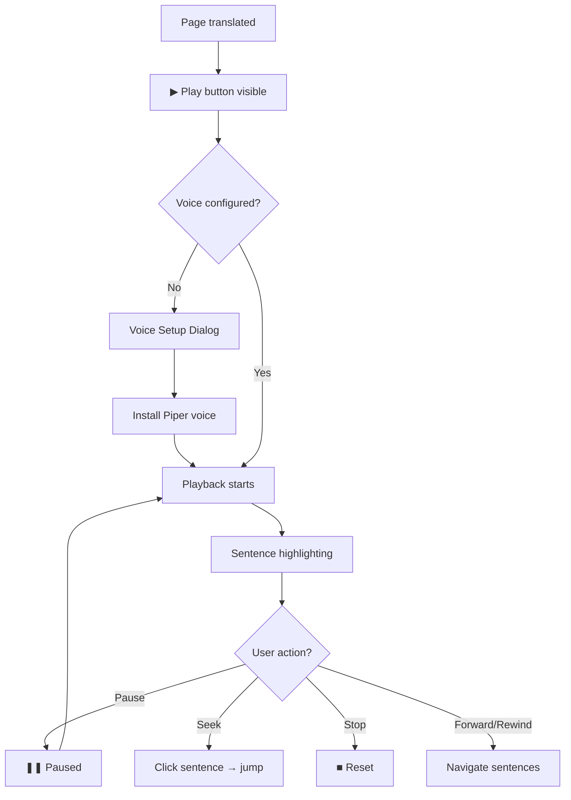

# Translation to TTS Workflow

> After a page is translated, how users listen to the result through neural text-to-speech.

---

## Steps

### 1. Translation Complete
- A page card on the [[Workspace Page]] shows the completed AI result
- A green dot (●) indicates "done" status in the card header
- The ▶ Play button appears in the card header

### 2. First-Time Voice Setup
- User clicks ▶ Play
- If no voice is configured for the current language → [[ExplainSetupDialog|TTS Voice Setup Dialog]] opens
- User selects a [[Piper Neural TTS|Piper voice]] from the catalog
- Install downloads the ONNX model (~20–60 MB) to [[IndexedDB Storage]]
- After install: playback starts automatically

### 3. Playback
- The [[Text-to-Speech]] system splits the result into sentence chunks
- Each chunk is synthesized via [[Piper WASM Engine]] (or [[Web Speech API]] fallback)
- Current sentence highlighted with `.reader-chunk-active` (green glow)
- Buffered sentences show `.reader-chunk-buffered` (subtle underline)

### 4. Playback Controls
Located in the page card header:

| Button | Action |
|--------|--------|
| ▶ Play | Start or resume |
| ❚❚ Pause | Pause playback |
| ‹ Rewind | Previous sentence |
| › Forward | Next sentence |
| ■ Stop | Stop and reset |

### 5. Sentence Seeking
- Click any sentence chunk in the result text → TTS jumps to that position
- Enables random-access listening within the translated content

### 6. Speed & Pitch Control
- Configured on the [[Voice Settings Page]]
- Speed: 0.25× to 4× (default 1.0×)
- Pitch: 0 to 2 (default 1.0)

---

## Flow Diagram

---

## Related

- [[PDF to Translation Workflow]] — Previous step in the journey
- [[Text-to-Speech]] — Feature overview
- [[Piper Neural TTS]] — Neural engine details
- [[Voice Settings Page]] — Voice configuration
- [[Workspace Page]] — Where playback happens
- [[TTS Pipeline]] — Team pipeline perspective
- [[PageWorkstation]] — Component hosting TTS controls

---

*Part of [[MOC — User Flows]]*
