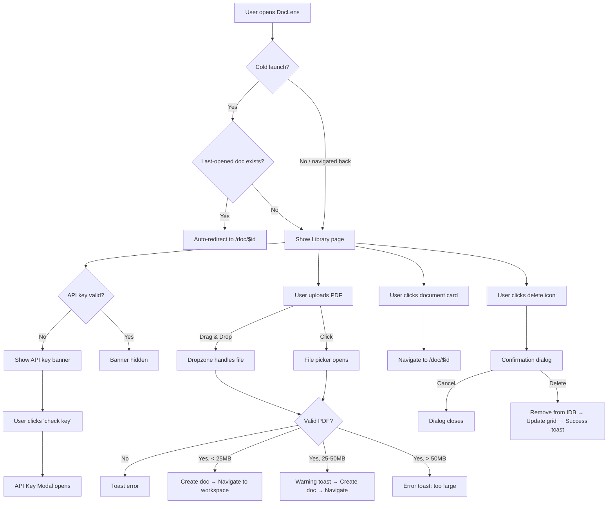

# Library Page — UI/UX Design Document

> **Route:** `/` (index)  
> **File:** [index.tsx](file:///home/sanskar/Downloads/doclens-ai/src/routes/index.tsx)  
> **Layout:** [SidebarLayout](file:///home/sanskar/Downloads/doclens-ai/src/components/SidebarLayout.tsx)  
> **SEO Title:** `DocLens — Document Library`

---

## Purpose

The Library page is the **primary landing surface** of DocLens AI. It serves as the document management hub where users upload, browse, and manage their PDF documents. It is the first page users see on cold launch and acts as the central navigation nexus for the entire application.

The page fulfills three core responsibilities:

1. **Document ingestion** — drag-and-drop or click-to-upload PDF files
2. **Document browsing** — visual grid of stored documents with thumbnails, metadata, and status badges
3. **Session continuity** — automatic restoration to the last-opened document on cold launch

---

## Layout Overview

```
┌──────────────────────────────────────────────────────┐
│                  Full-height flex row                 │
├──────────┬───────────────────────────────────────────┤
│          │  Top Bar (h-14/h-16)                      │
│          │  ┌──────────────────────────────────────┐ │
│  Sidebar │  │ ☰ (mobile) │ "Library" │ Doc Count  │ │
│  (w-64)  │  │            │           │ + API Badge│ │
│          │  └──────────────────────────────────────┘ │
│  ──────  │  ──────────────────────────────────────── │
│  ◐ Logo  │  Scrollable Content (overflow-y-auto)     │
│  📁 Lib  │  ┌──────────────────────────────────────┐ │
│  ⚙ Gen   │  │  Hero: "Intelligence Library"        │ │
│  🎙 Voice│  │  API Key Banner (conditional)         │ │
│          │  │  Dropzone (h-56)                      │ │
│ (spacer) │  │                                       │ │
│  + New   │  │  ☰ Recent Documents     [Grid] [List] │ │
│  ─────── │  │  ┌────┐ ┌────┐ ┌────┐ ┌────┐        │ │
│  ❓Support│  │  │Card│ │Card│ │Card│ │Card│        │ │
│          │  │  └────┘ └────┘ └────┘ └────┘        │ │
│          │  └──────────────────────────────────────┘ │
└──────────┴───────────────────────────────────────────┘
```

The layout uses `SidebarLayout`, a persistent chrome shared across Library, General Settings, and Voice Settings pages. The sidebar is fixed at `w-64` on desktop (`md:` breakpoint and above) and collapses to a hamburger-triggered drawer on mobile.

---

## UI Components

---

### 1. Sidebar Navigation Panel

> **Component:** [SidebarLayout.tsx](file:///home/sanskar/Downloads/doclens-ai/src/components/SidebarLayout.tsx)

#### 1.1 Logo Block

- **Description:** DocLens brand mark — a `◐` symbol in a rounded green square alongside the app name "DocLens" with subtitle "AI Intelligence".
- **Functionality:** Clicking the logo navigates to `/` (this page). The entire block is a `<Link>` to the root route.
- **UX Rationale:** Establishes brand identity and provides a reliable "home" affordance regardless of current page. The logo's green glow (`box-shadow: 0 0 18px rgba(78,222,163,0.2)`) subtly reinforces the primary brand color.
- **User Benefits:** One-click home navigation from anywhere in the app.
- **Placement:** Top of sidebar (`px-6 pt-8 pb-6`) — standard pattern for SaaS-style left navigation. Logo placement here provides visual anchoring.

#### 1.2 Navigation Links

Three persistent nav items with emoji icons:

| Icon | Label            | Route             | Active Match     |
| ---- | ---------------- | ----------------- | ---------------- |
| 📁   | Library          | `/`               | Exact match only |
| ⚙    | General Settings | `/settings`       | Fuzzy match      |
| 🎙   | Voice Settings   | `/settings/voice` | Fuzzy match      |

- **Description:** Vertically stacked navigation links, each with an emoji icon and text label.
- **Functionality:** Clicking navigates to the respective route. The active item receives a right-border accent (`border-r-2 border-primary`), bold text, and a tinted background (`bg-surface-2/60`).
- **UX Rationale:** Left sidebar navigation is the industry standard for multi-section applications. The active indicator uses a **right-side border accent** rather than a left-side one, creating a subtle "tab extending into content" visual metaphor.
- **State Changes:**
  - **Active:** `border-r-2 border-primary bg-surface-2/60 text-primary font-bold`
  - **Inactive:** `text-muted-foreground`
  - **Hover:** `hover:bg-surface-2/40 hover:text-foreground`
- **Accessibility:** Each link is a semantic `<Link>` element with clear text labels alongside icons.

#### 1.3 New Document Button

- **Description:** Full-width green CTA button at the bottom of the sidebar reading "+ New Document".
- **Functionality:** Triggers a hidden `<input type="file" accept="application/pdf,.pdf">` file picker. On file selection, calls the `onNewDocument` callback.
- **UX Rationale:** Persistent placement at the sidebar bottom ensures the upload affordance is always accessible regardless of scroll position. The prominent green fill makes it the highest-priority action in the sidebar.
- **User Benefits:** Users never need to scroll to find the upload action.
- **State Changes:**
  - **Hover:** `hover:opacity-90`
  - **Active (pressed):** `active:scale-[0.97]` — subtle press-down micro-animation
- **Placement:** Bottom of sidebar, separated from navigation by a flex spacer. This follows the "primary action at extremity" pattern (e.g., Gmail's "Compose" button).

#### 1.4 Support Link

- **Description:** An `❓ Support` link at the very bottom of the sidebar, separated by a `border-t` divider.
- **Functionality:** Currently a placeholder (`href="#"`).
- **UX Rationale:** Provides a designated location for help/support without cluttering the main navigation.
- **Placement:** Below the CTA, anchored to the sidebar bottom, following conventional help-link placement.

---

### 2. Top Bar

- **Description:** A `h-14` (mobile) / `h-16` (desktop) header strip with backdrop blur, spanning the full content width.
- **Components:**
  - **Left:** Hamburger menu button (mobile only) + Page title "Library" in `text-xl md:text-2xl font-black text-primary`
  - **Right:** Document count badge + API key status badge

#### 2.1 Hamburger Menu Button (Mobile)

- **Description:** Three-line hamburger icon (`md:hidden`), only visible below the `md` breakpoint.
- **Functionality:** Opens the sidebar as a full-height slide-in drawer with a backdrop overlay (`bg-black/60 backdrop-blur-sm`).
- **UX Rationale:** Standard responsive pattern — preserves the full sidebar on mobile without consuming persistent screen space.
- **Accessibility:** `aria-label="Open menu"`. The drawer uses `aria-modal="true"` and `role="dialog"`.
- **State Changes:** Overlay includes a close button (`✕`) and clicking the backdrop also dismisses the drawer.

#### 2.2 Page Title

- **Description:** Bold text reading "Library" in primary green color.
- **Functionality:** Static label — identifies the current page.
- **UX Rationale:** Immediate context for the user about where they are. The primary color treatment connects the title to the brand.
- **Placement:** Left side of top bar — standard title position.

#### 2.3 Document Count Badge

- **Description:** A pill-shaped badge displaying the number of documents (e.g., "3 documents") or "loading…" during initial load.
- **Functionality:** Real-time count of documents stored in IndexedDB.
- **UX Rationale:** Provides instant inventory awareness without scrolling. The monospaced, uppercase styling (`font-mono text-[11px] uppercase tracking-widest`) gives it a technical, data-readout feel consistent with the app's intelligence/analytics aesthetic.
- **State Changes:**
  - **Loading:** Shows "loading…"
  - **Loaded:** Shows `N document(s)` with correct pluralization

#### 2.4 API Key Status Badge

> **Component:** [ApiKeyStatusBadge.tsx](file:///home/sanskar/Downloads/doclens-ai/src/components/ApiKeyStatusBadge.tsx)

- **Description:** A small pill-shaped badge showing the OpenRouter API key status with a colored dot indicator.
- **Functionality:** Clicking opens the API Key Modal for configuration/verification. Automatically validates the key on mount.
- **States:**

| Status    | Label                | Color             |
| --------- | -------------------- | ----------------- |
| `valid`   | `connected`          | Green (primary)   |
| `invalid` | `server key invalid` | Red (destructive) |
| `missing` | `env key missing`    | Red (destructive) |
| `unknown` | `key not verified`   | Muted             |

- **UX Rationale:** Provides persistent, at-a-glance visibility of API connectivity — critical because all AI features depend on this key.
- **Placement:** Top-right of every page — the standard position for system-status indicators.

---

### 3. Hero Section

- **Description:** A title block with the heading "Intelligence Library" and subtitle "Read it. Hear it. Own it — in the language that owns your heart."
- **Functionality:** Static branding/messaging.
- **UX Rationale:** Sets the emotional tone and value proposition. The subtitle communicates three core capabilities (read, hear, own) and the multi-language focus. The heading uses `text-4xl font-bold tracking-tight` for visual hierarchy dominance.
- **Placement:** First element in the scrollable content area, establishing context before interactive elements.

---

### 4. API Key Banner (Conditional)

- **Description:** A horizontal banner that appears when the API key is not valid. Adapts its appearance based on whether the key is `invalid` (red theme) or simply not configured (blue/primary theme).
- **Functionality:**
  - Displays contextual messaging explaining the issue
  - Includes a "check key" button that opens the API Key Modal
- **UX Rationale:** Inline contextual guidance is more effective than relying on users to check settings. The banner appears right before the upload area, intercepting the user's flow at the natural point where they'd want to use AI features.
- **State Variations:**
  - **Invalid key:** `border-destructive/40 bg-destructive/10` with red label "API KEY INVALID"
  - **Not configured:** `border-primary/40 bg-primary/5` with primary-colored label "GET STARTED"
  - **Valid key:** Banner is hidden entirely
- **User Benefits:** Prevents confusion when AI features fail — users get proactive guidance.

---

### 5. Dropzone (Upload Area)

> **Component:** [Dropzone.tsx](file:///home/sanskar/Downloads/doclens-ai/src/components/Dropzone.tsx)

- **Description:** A large (`h-56`) dashed-border area with a centered upload icon (↑), instructional text, and constraints info.
- **Functionality:**
  - **Drag & drop:** Accepts PDF files dropped onto the area
  - **Click to browse:** Clicking anywhere triggers the native file picker
  - **Validation:** Enforces PDF-only, max 50 MB hard limit, 25 MB warning threshold, and rejects empty files
  - On success: Creates document in IndexedDB, navigates to `/doc/$id`
- **Visual Layers:**
  - Background grid pattern (`.bg-grid`) for visual depth
  - Radial gradient hover effect that fades in on hover
  - Centered upload icon in a `h-16 w-16` circle
- **State Changes:**
  - **Default:** Dashed border, muted colors
  - **Hover:** `hover:border-primary/70 hover:bg-primary/5`, icon scales up (`group-hover:scale-105`) and changes to filled green
  - **Dragging over:** `border-primary bg-primary/10 shadow-[0_0_24px_rgba(78,222,163,0.12)]` — stronger visual feedback
- **Text Content:**
  - Primary: "Click or drag PDF documents here"
  - Secondary: "PDF only · max 50.0 MB"
  - Tertiary: "processed entirely in your browser · nothing uploaded" — privacy assurance
- **Error Handling:** Toast notifications for invalid file type, oversized files, empty files. Warning toast for files between 25–50 MB.
- **UX Rationale:** The drop zone is deliberately oversized to maximize the drag target area. The privacy message addresses the #1 concern for document processing tools.
- **Accessibility:** The hidden file input accepts `application/pdf,.pdf` for both MIME type and extension matching.
- **Placement:** Prominent position between the hero section and document grid — the natural "next action" position.

---

### 6. Document Grid Section

#### 6.1 Section Header

- **Description:** A flex row with "☰ Recent Documents" label on the left and grid/list view toggle buttons on the right.
- **Components:**
  - **Label:** `☰` icon + "RECENT DOCUMENTS" in uppercase, extra-bold tracking
  - **Grid view button:** 4-square icon, darker background (`bg-surface-2`)
  - **List view button:** 3-line icon, lighter background (`bg-surface`)
- **Functionality:** View toggle buttons are present in the UI but do not currently switch between grid and list layouts — they exist as design affordances for future implementation.
- **UX Rationale:** Section heading with a utility toolbar follows the content-section pattern. The view toggles signal that the app has considered different display modes, even if not yet functional.

#### 6.2 Document Cards (Grid)

> **Component:** [DocumentCard.tsx](file:///home/sanskar/Downloads/doclens-ai/src/components/DocumentCard.tsx)

The grid uses a responsive column layout: `grid-cols-1 sm:grid-cols-2 lg:grid-cols-3 xl:grid-cols-4`

Each card contains:

**Thumbnail Area (h-40):**

- **Description:** PDF first-page thumbnail with a gradient overlay (`bg-gradient-to-t from-background to-transparent`).
- **Functionality:** Loaded asynchronously via `useThumbnail` hook. Shows spinner while loading, fallback "PDF" badge if no thumbnail available.
- **State Changes:**
  - **Loading:** Spinning border animation
  - **Loaded:** Thumbnail at `opacity-60` with `group-hover:scale-105` zoom effect (500ms transition)
  - **No thumbnail:** Static "PDF" badge in a rounded square
- **Status Badges:** "Extracted" badge appears in the top-right corner when the document has been analyzed (`doc.hasExtraction`).

**Document Info Block:**

- **File name** — truncated with `truncate`, transitions to primary color on hover
- **Tags:**
  - "AI PROCESSED" badge (accent color) if extraction exists
  - "N Results" badge (muted) showing AI result count

**Footer:**

- **Page count:** `📄 N Pgs`
- **File size:** `💾 N.N MB/KB`
- **Delete button:** Three-dot vertical menu icon, invisible by default (`opacity-0`), appears on card hover (`group-hover:opacity-100`). Triggers delete confirmation dialog.

**Card Interactions:**

- **Click:** Navigates to `/doc/$id` — the entire card is a `<Link>`
- **Hover:** Card lifts (`hover:-translate-y-1`) with enhanced shadow (`hover:shadow-[0_18px_45px_rgba(0,0,0,0.22)]`)
- **Delete:** Click the delete icon (stops event propagation to prevent navigation)

**Card Visual Treatment:**

- Uses `.glass-panel` class — glassmorphic with `backdrop-filter: blur(12px)` and translucent background
- Rounded corners (`rounded-xl`) with padding (`p-3`)
- Smooth 300ms transition on all properties

#### 6.3 Empty State

- **Description:** A dashed-border panel with "EMPTY LIBRARY" heading and instructional text.
- **Functionality:** Displayed when `docs.length === 0` after loading completes.
- **UX Rationale:** Prevents a blank void. Directs users to the upload area above. The dashed border connects visually to the dropzone's dashed border, reinforcing the "upload here" message.

---

### 7. Delete Confirmation Dialog

> **Components:** AlertDialog from shadcn/ui

- **Description:** Modal dialog asking "Delete document?" with the document filename highlighted.
- **Functionality:**
  - Shows when a delete button is clicked on any card
  - Displays: "This will permanently delete **{filename}** and all its AI results. This action cannot be undone."
  - **Cancel** button: Dismisses the dialog
  - **Delete** button: Removes the document from IndexedDB, updates the grid, shows success toast
- **UX Rationale:** Destructive action confirmation prevents accidental data loss. The filename is displayed in bold to ensure users know exactly what they're deleting.
- **State Changes:** Controlled by `deleteTarget` state — `null` = closed, `DocSummary` = open.
- **Design Consistency:** Uses the shadcn AlertDialog pattern with destructive styling on the confirm button (`bg-destructive text-destructive-foreground`).

---

### 8. Global Overlays

#### 8.1 API Key Modal

> **Component:** [ApiKeyModal.tsx](file:///home/sanskar/Downloads/doclens-ai/src/components/ApiKeyModal.tsx)

- **Description:** A dialog that can be triggered from anywhere in the app via the `doclens:open-api-key-modal` window event.
- **Functionality:** Displays current key status, allows validation via "check server key" button, links to OpenRouter's key management page.
- **Placement:** Mounted in `__root.tsx` — globally available.

#### 8.2 Toast Notifications

- **Description:** Bottom-right positioned toast notifications (via Sonner).
- **Types used on this page:**
  - `toast.success()` — document added, document deleted
  - `toast.error()` — upload failure, quota exceeded, delete failure
  - `toast.warning()` — large file size warning

---

## User Journey



---

## Design Decisions

### 1. Cold Launch Auto-Restore

The page checks `sessionStorage` for a "cold launch handled" flag. On the very first mount of a session, it reads the last-opened document ID from IndexedDB and auto-navigates there. This provides **session continuity** — users resume exactly where they left off. Subsequent navigations to `/` always show the Library, preventing the jarring experience of being redirected away when you deliberately go "home."

### 2. Glassmorphic Visual System

Cards use the `.glass-panel` class with `backdrop-filter: blur(12px)` and semi-transparent backgrounds. This creates depth without harsh borders, aligning with the "Deep Ocean" dark theme palette (`--background: #0b1326`).

### 3. Monospaced Uppercase Labels

Technical labels (document count, dropzone constraints, section headers) use `font-mono text-[10-11px] uppercase tracking-widest`. This creates a "data readout" or "HUD" aesthetic that reinforces the app's technical/intelligence positioning.

### 4. Privacy-First Messaging

The dropzone prominently displays "processed entirely in your browser · nothing uploaded." This is a deliberate trust signal — critical for a document processing application where users handle sensitive PDFs.

### 5. Progressive Disclosure of Delete

The delete button is hidden (`opacity-0`) and only appears on card hover. This prevents accidental deletions and keeps the card visually clean. On mobile where hover isn't available, the button would need to be always visible or accessible via a long-press menu (current implementation may need mobile consideration).

---

## Accessibility Considerations

| Element             | Implementation                            |
| ------------------- | ----------------------------------------- |
| Hamburger menu      | `aria-label="Open menu"`                  |
| Mobile sidebar      | `aria-modal="true"`, `role="dialog"`      |
| Close menu button   | `aria-label="Close menu"`                 |
| Grid view button    | `aria-label="Grid view"`                  |
| List view button    | `aria-label="List view"`                  |
| Delete button       | `aria-label="Delete document"`            |
| File input          | `accept="application/pdf,.pdf"`           |
| Page title          | `<h2>` in top bar, `<h3>` in hero section |
| Document thumbnails | `alt="Preview of {filename}"`             |

> [!WARNING]
> The delete button's `opacity-0` on non-hover states may make it inaccessible to keyboard-only users. Consider ensuring the button is reachable via Tab focus even when visually hidden.

---

## Future Improvement Opportunities

1. **Grid/List view toggle** — The view toggle buttons are present but non-functional. Implement list view with denser information display for power users.
2. **Search and filter** — No document search currently exists. Adding a search bar in the "Recent Documents" header would improve findability as libraries grow.
3. **Sort options** — Documents appear in insertion order. Sort by name, date, size, or AI processing status.
4. **Multi-select and bulk delete** — Currently only single-document deletion is supported.
5. **Mobile delete affordance** — The hover-based delete button reveal doesn't work on touch devices. Consider swipe-to-delete or a visible kebab menu.
6. **Drag reordering** — Allow users to organize their document library.
7. **Document metadata display** — Show date added, last accessed, translation progress percentage.
8. **Folder/tag organization** — Group documents into collections for users with large libraries.
