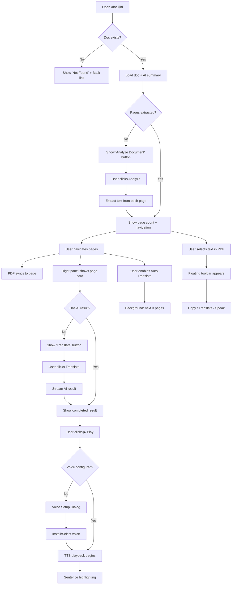

# Workspace Page — UI/UX Design Document

> **Route:** `/doc/$id`  
> **File:** [doc.$id.tsx](file:///home/sanskar/Downloads/doclens-ai/src/routes/doc.$id.tsx)  
> **Key Components:** [PdfViewer](file:///home/sanskar/Downloads/doclens-ai/src/components/PdfViewer.tsx), [RightPanel](file:///home/sanskar/Downloads/doclens-ai/src/components/RightPanel.tsx), [PageWorkstation](file:///home/sanskar/Downloads/doclens-ai/src/components/PageWorkstation.tsx)  
> **SEO Title:** `DocLens — Document`

---

## Purpose

The Workspace is the **core operational page** of DocLens AI — where documents are viewed, analyzed, translated, and read aloud. It provides a split-panel interface: the original PDF on the left and AI processing/results on the right. Every interaction — from text selection to TTS playback to batch translation — happens within this page.

This is where the application's three core value propositions converge:

1. **Read it** — PDF rendering with text selection
2. **Hear it** — Neural TTS playback with sentence-level highlighting
3. **Own it** — AI translation and explanation in the user's chosen language

---

## Layout Overview

```
┌────────────────────────────────────────────────────────┐
│  Slim Header (h-12)                                    │
│  ← Back │ Document Name │ ‹ [Page N / Total] › │ ⚙ ↻  │
├──────────────────────────┬─────────────────────────────┤
│                          │                             │
│   PDF Viewer (50%)       │   Right Panel (50%)         │
│                          │   ┌───────────────────────┐ │
│   ┌──────────────┐       │   │ [AI Assistant] [Text] │ │
│   │   Page 1     │       │   │ ─────────────────── ↓ │ │
│   │   (canvas)   │       │   │ Toolbar: N/M pages    │ │
│   │   + textLayer│       │   │ [Auto-Translate ●]    │ │
│   └──────────────┘       │   │ ─────────────────────  │ │
│         ↕ gap            │   │                        │ │
│   ┌──────────────┐       │   │  Page Card             │ │
│   │   Page 2     │       │   │  ┌──────────────────┐  │ │
│   │   (canvas)   │       │   │  │ Page N   ● ▶ ⚙ ▊│  │ │
│   │   + textLayer│       │   │  │                  │  │ │
│   └──────────────┘       │   │  │ [AI Result text] │  │ │
│         ↕ gap            │   │  │ or               │  │ │
│   ┌──────────────┐       │   │  │ [Translate] btn  │  │ │
│   │   Page 3     │       │   │  └──────────────────┘  │ │
│   │   ...        │       │   │                        │ │
│   └──────────────┘       │   └────────────────────────┘ │
│                          │                             │
│   [Floating selection    │   [Floating batch progress  │
│    toolbar]              │    pill]                     │
│                          │                             │
└──────────────────────────┴─────────────────────────────┘
```

The main content area uses a 50/50 two-column grid (`grid-cols-1 md:grid-cols-2`). On mobile, the panels stack vertically. The page fills the full viewport height (`h-screen flex-col`).

---

## UI Components

---

### 1. Document Header Bar

- **Description:** A slim `h-12` header bar with backdrop blur (`bg-surface/80 backdrop-blur-md`) divided into three sections: left (navigation + title), center (page navigation), and right (actions).

#### 1.1 Back Button (←)

- **Description:** An `h-8 w-8` button with a left arrow character.
- **Functionality:** Navigates back to the Library page (`/`).
- **UX Rationale:** The workspace is a "deep" page without sidebar navigation. The back button provides the only way to return to the library. Its placement at the top-left follows the universal "back" position.
- **State Changes:** `hover:bg-surface-2 hover:text-foreground`
- **Accessibility:** `title="Back to Library"`
- **Placement:** Top-left — following OS-level back button conventions.

#### 1.2 Document Title

- **Description:** The document filename (without `.pdf` extension) displayed in `text-sm font-semibold`, with `truncate` for overflow.
- **Functionality:** Static display — provides context for which document is open.
- **UX Rationale:** The slim header keeps the title compact to preserve vertical space for the PDF and AI panels. The `.pdf` extension is stripped for cleanliness.

#### 1.3 Page Navigation Controls (Center)

Only visible when `pageCount > 0` (i.e., after extraction).

| Element              | Description                                                                                                                                            |
| -------------------- | ------------------------------------------------------------------------------------------------------------------------------------------------------ |
| **Previous (‹)**     | `h-8 w-8` button, decrements active page. Disabled at page 1.                                                                                          |
| **Page Selector**    | `<select>` dropdown with all page numbers (1 to N), centered in a rounded pill container (`bg-surface-2/60`). Dynamic `minWidth` based on digit count. |
| **"/ N" label**      | Total page count displayed as `/ {pageCount}` in muted text.                                                                                           |
| **Next (›)**         | `h-8 w-8` button, increments active page. Disabled at last page.                                                                                       |
| **Translated count** | `text-[10px] text-primary` showing "N translated" when at least one page has AI results.                                                               |

- **Functionality:** Changes the `activePage` state, which:
  1. Updates the URL query parameter (`?page=N`) via `replace: true`
  2. Scrolls the PDF viewer to the corresponding page
  3. Loads the corresponding page card in the right panel
- **UX Rationale:** Central placement creates a focal point for the most frequent interaction (page navigation). The dropdown allows random-access page jumping for large documents. The translated count provides progress awareness.
- **State Changes:**
  - **Disabled buttons:** `disabled:opacity-30`
  - **URL sync:** Page number is persisted in the URL for bookmarkability and refresh persistence
- **Accessibility:** `aria-label="Previous page"`, `aria-label="Select page"`, `aria-label="Next page"`

#### 1.4 Action Buttons (Right)

**Analyze Document Button** (shown when `pageCount === 0`):

- **Description:** Prominent green button reading "Analyze Document" / "Analyzing…"
- **Functionality:** Triggers PDF text extraction — reads the PDF binary from IndexedDB, processes each page for text content, column layout, and garbage ratio, then stores results.
- **State Changes:**
  - **Idle:** `bg-primary px-3 py-1.5 text-xs font-semibold`
  - **Running:** Shows "Analyzing…", `disabled:opacity-50`
  - **Progress:** Status bar shows "page N/M" in the header

**Re-Extract Button (↻)** (shown when `pageCount > 0`):

- **Description:** Compact `h-8 w-8` icon button with a refresh symbol.
- **Functionality:** Re-runs text extraction. Shows spinner while running.
- **State Changes:** Disabled during analysis, shows animated spinner.
- **Tooltip:** Shows status message during analysis, "Re-extract pages" otherwise.

**Settings Link (⚙)**:

- **Description:** Compact `h-8 w-8` link to `/settings`.
- **Functionality:** Quick access to settings from within the workspace.
- **UX Rationale:** Power users frequently adjust model, language, or temperature while working on a document. This shortcut avoids requiring a full trip through the sidebar.

---

### 2. PDF Viewer (Left Panel)

> **Component:** [PdfViewer.tsx](file:///home/sanskar/Downloads/doclens-ai/src/components/PdfViewer.tsx)

#### 2.1 Architecture Overview

The PDF viewer implements a **virtualized, lazy-rendering approach**:

1. **On mount:** Load all page metadata (dimensions, scale) but render no bitmaps
2. **IntersectionObserver:** Render canvas + text layer only for visible pages (with 200px root margin)
3. **Memory cap:** At most `MAX_RENDERED = 5` pages hold bitmap data simultaneously
4. **Eviction:** When a 6th page enters view, the oldest rendered page has its canvas dimensions zeroed (releasing GPU bitmap memory) and its text layer cleared

Each page is rendered at `TARGET_WIDTH = 800px` scaled by the device pixel ratio (`DPR`) for retina-sharp rendering.

#### 2.2 Page Containers

- **Description:** Vertically stacked page containers (`flex-col items-center gap-4 py-6 px-4`) centered in a scrollable container with a dark gradient background (`.pdf-viewer-bg`).
- **Visual Treatment:**
  - Each page has `rounded-4px` corners, drop shadow, and a subtle border
  - **Active page:** Left green accent border (`-3px 0 0 0 var(--primary)`) and tinted glow
  - **Page number badge:** Floating pill at bottom-center (`position: absolute, bottom: 8px, left: 50%`) with blurred dark background
- **Functionality:** Clicking a page (without text selected) sets it as the active page, syncing the right panel.

#### 2.3 Text Layer (Selectable Text)

- **Description:** An invisible text layer overlaid precisely on top of each canvas using pdf.js `TextLayer`.
- **Functionality:**
  - Enables native text selection (cursor changes to text cursor)
  - Selection triggers the floating selection toolbar
  - Text is transparent (`color: transparent`) — only the selection highlight is visible
  - Uses CSS custom properties for precise scaling: `--scale-factor`, `--font-height`, `--rotate`, `--scale-x`
- **UX Rationale:** Users expect to be able to select and copy text from PDFs. The text layer provides this capability without compromising the visual quality of the canvas render.
- **Selection highlight:** `background: rgba(64, 128, 255, 0.35)` — standard blue selection color.
- **Scanned PDFs:** Pages with no extractable text get no text spans — the toolbar simply never appears.

#### 2.4 Floating Selection Toolbar

- **Description:** A pill-shaped floating toolbar (`.selection-toolbar`) that appears above selected text.
- **Position:** Absolutely positioned at the midpoint-top of the selection range, with `transform: -translate-x-1/2 -translate-y-full`.
- **Buttons:**

| Icon   | Action           | Description                                                                                                                                                |
| ------ | ---------------- | ---------------------------------------------------------------------------------------------------------------------------------------------------------- |
| 📋     | **Copy**         | Copies selected text to clipboard                                                                                                                          |
| 🌐     | **Translate**    | Dispatches `doclens:translate-selection` event, which the right panel's PageWorkstation intercepts to run AI translation on the selected text specifically |
| 🔊 / ⏹ | **Speak / Stop** | Initiates or stops Piper neural TTS for the selection. If no TTS voice is configured, opens the TtsVoiceSetupDialog first.                                 |

- **Visual Treatment:**
  - Glassmorphic pill: `backdrop-filter: blur(16px)`, semi-transparent dark background, subtle border
  - 32px circular buttons with hover highlights
  - The translate button uses `primary-action` class for green accent coloring
- **UX Rationale:** Contextual actions on selected text eliminate the need to switch panels or use menus. This is a power-user pattern inspired by annotation tools and browser extensions.
- **Behavior:** The toolbar tracks the selection in real-time via the `selectionchange` event. It disappears when the selection collapses.

#### 2.5 Loading & Error States

- **Loading:** Centered spinner with "loading pdf…" in monospace uppercase
- **Error:** Centered error message in destructive red (e.g., "PDF binary not found in storage." or "Failed to load PDF.")

#### 2.6 Page Synchronization

The PDF viewer supports bidirectional page sync:

- **→ From header/right panel:** When `activePage` changes externally, the viewer smoothly scrolls to the corresponding page (`scrollIntoView({ behavior: "smooth", block: "start" })`). Only scrolls if the page is not already visible.
- **→ From custom event:** Listens for `doclens:scroll-to-pdf` CustomEvent, enabling the right panel to trigger scrolling even when `activePage` hasn't changed.
- **→ To right panel:** Clicking a page in the PDF sets `activePage`, which the right panel reacts to.

---

### 3. Right Panel

> **Component:** [RightPanel.tsx](file:///home/sanskar/Downloads/doclens-ai/src/components/RightPanel.tsx)

#### 3.1 Tab Bar

- **Description:** Horizontal tab strip at the top of the right panel with two tabs and an action area.
- **Tabs:**

| Tab    | Label             | Content                                            |
| ------ | ----------------- | -------------------------------------------------- |
| `ai`   | **AI Assistant**  | PageWorkstation — translate, explain, TTS playback |
| `text` | **Original Text** | Raw extracted text for the active page             |

- **Active indicator:** A 2px-high green underline that spans the tab text (`absolute inset-x-3 -bottom-px h-[2px] rounded-full bg-primary`).
- **UX Rationale:** Two-tab design keeps the interface simple. "AI Assistant" is the default because it's the primary use case. "Original Text" provides a reference for comparison or debugging.

#### 3.2 Analysis Status Spinner

- **Description:** Animated spinner with status text (e.g., "page 5/20") shown in the tab bar's right section during document analysis.
- **Functionality:** Real-time progress feedback during the extraction pipeline.

#### 3.3 Export Dropdown

- **Description:** A small `h-7 w-7` down-arrow button in the tab bar, revealing a dropdown with export options.
- **Options:**
  - **Export as Markdown** — Downloads a `.md` file with all pages' extracted text and AI results
  - **Export as JSON** — Downloads a `.json` file with structured data including token estimates, column counts, AI results, and settings hashes
- **UX Rationale:** Users who process documents need to share or archive results. The dropdown keeps the interface clean while providing two standard export formats.
- **Behavior:** Dropdown appears on click, positioned `absolute right-0 top-full` with shadow and border.

---

### 4. AI Assistant Tab (PageWorkstation)

> **Component:** [PageWorkstation.tsx](file:///home/sanskar/Downloads/doclens-ai/src/components/PageWorkstation.tsx) — 1396 lines, the largest component in the application.

#### 4.1 Setup/Error States

Before showing the main interface, the PageWorkstation displays contextual guidance:

| State                  | Display                                                             |
| ---------------------- | ------------------------------------------------------------------- |
| **Model loading**      | Spinner + "Loading model defaults..."                               |
| **No API key**         | "API Key Required" with "Check API Key" and "Open Settings" buttons |
| **Invalid key**        | "API Key Invalid" with error message and action buttons             |
| **No model selected**  | "Setup Required" with link to Settings                              |
| **No pages extracted** | "Analyze the document to get started with AI translations."         |

- **UX Rationale:** Each setup state provides actionable guidance rather than a generic error. This reduces user confusion and creates clear pathways to resolution.

#### 4.2 Compact Toolbar

- **Description:** A thin border-bottom bar with translation progress on the left and controls on the right.
- **Left side:** "N of M pages translated" or "N pages ready"
- **Right side:** Auto-Translate toggle button

##### Auto-Translate Toggle

- **Description:** A custom toggle pill with sliding indicator, labeled "Auto-Translate".
- **Functionality:**
  - **ON:** Automatically translates the next 3 pages ahead of the user's current position in the background. Re-triggers on every page navigation. Cancels previous batch when the user jumps.
  - **OFF:** All background translation stops. Running batches are cancelled.
  - State persists per document via `localStorage` key `doclens.autoTranslate.{docId}`.
- **Visual States:**
  - **ON:** `bg-primary/15 text-primary ring-1 ring-primary/30` with green toggle pill
  - **OFF:** `bg-surface-2/60 text-muted-foreground` with gray toggle pill
- **UX Rationale:** Implements an "ebook reader" experience — as users read, upcoming pages are pre-translated. This eliminates wait times and creates seamless reading flow. The toggle makes it opt-in since batch translation consumes API credits.
- **Tooltip:** Detailed description of behavior on hover.

#### 4.3 Page Card (Single Active Page)

The main content area shows a single page card that changes based on `activePage`. Each card is wrapped in a `.reader-card` container with entry animation (`.page-card-enter`).

##### Card Header

| Element                   | Description                                          |
| ------------------------- | ---------------------------------------------------- |
| **"Page N"**              | Uppercase, tracking-wider label                      |
| **Status dot**            | Green = done, spinner = running, red = error         |
| **"Custom" badge**        | Shown if the page uses a custom JSON request         |
| **"N override(s)" badge** | Shown if page-level setting overrides exist          |
| **TTS controls**          | Play/Pause, Rewind, Forward, Stop buttons (see §4.4) |
| **Settings gear (⚙)**     | Toggles the per-page override panel                  |
| **Run/Stop button**       | Green "Translate" button or red "Stop" button        |

##### Run/Stop Button

- **Run (Translate/Explain):**
  - Label changes based on mode: "Translate", "Explain", "Summarize", "Custom Prompt"
  - Green primary button style
  - On first click (if mode is "explain" and setup not done), opens `ExplainSetupDialog` to configure language and style
- **Stop:**
  - Red-bordered destructive button
  - Aborts the streaming API call via `AbortController`

##### Settings Panel (Collapsible)

Toggled by the ⚙ gear button. Uses CSS grid animation (`.collapsible-content`) for smooth open/close.

**Contains:**

| Control               | Type            | Description                                                 |
| --------------------- | --------------- | ----------------------------------------------------------- |
| **Mode**              | Select dropdown | Override: Translate, Explain, Summarize, Custom Prompt      |
| **Language**          | Select dropdown | Override: Quick language list (हिंदी, বাংলা, తెలుగు, etc.)  |
| **Style**             | Select dropdown | Override: Standard, Academic, Simplified, etc.              |
| **Model**             | Select dropdown | Override: Any model from the fetched OpenRouter list        |
| **Temperature**       | Range slider    | Override: 0.0 to 1.5 with value display                     |
| **Memory**            | Checkbox        | Override: Pass previous page excerpt for context continuity |
| **"Edit JSON"**       | Button          | Opens raw JSON editor for the API request payload           |
| **"Reset to Auto"**   | Button          | Clears custom request, reverts to auto-generated payload    |
| **"Clear Overrides"** | Button          | Removes all page-level overrides                            |

- **UX Rationale:** Per-page overrides enable power users to fine-tune individual pages (e.g., a particularly dense page might need a different model or higher temperature) without changing global settings.

##### JSON Editor

- **Description:** A monospace `<textarea>` (h-56) with the full OpenRouter API request payload.
- **Functionality:** Users can directly edit the JSON, save it, and run the modified request.
- **Error handling:** Shows inline error message if JSON is invalid.
- **UX Rationale:** Advanced/developer-oriented feature for users who want full control over the AI request. The "Edit JSON" → "Save" flow makes it explicit and reversible.

##### Result Display

Three states:

1. **Running (streaming):** Shows streamed text as it arrives (debounced at 150ms intervals). Shows "A bit longer, thanks for your patience..." if no tokens have arrived yet.
2. **Completed:** Displays the result in `.reader-text` styling (15px, 1.75 line-height). During TTS playback, text is split into clickable chunks with active/buffered highlighting.
3. **Empty:** Centered prompt "Click **Translate** to process this page."

##### Readable Result (TTS Integration)

When TTS is playing, the result text transforms into interactive chunks:

- **Active chunk:** `.reader-chunk-active` — green highlight with glow
- **Buffered chunks:** `.reader-chunk-buffered` — subtle underline
- **Seekable:** Clicking any chunk jumps TTS playback to that position

#### 4.4 TTS Playback Controls

Located in the page card header, these controls appear when a result exists:

| Button      | Icon | Action                                                                     |
| ----------- | ---- | -------------------------------------------------------------------------- |
| **Play**    | ▶    | Start or resume TTS. If no voice is configured, opens TtsVoiceSetupDialog. |
| **Pause**   | ❚❚   | Pause playback (shown only during playing/loading)                         |
| **Rewind**  | ‹    | Jump to previous sentence chunk                                            |
| **Forward** | ›    | Jump to next sentence chunk                                                |
| **Stop**    | ■    | Stop playback and reset reader state                                       |

- **UX Rationale:** The controls provide full audio player functionality inline with the content. The play button doubles as a setup trigger (for first-time voice configuration), reducing friction.
- **State-dependent visibility:** Rewind/Forward/Stop only appear when playback is active (not idle or ended).
- **Disabled states:** Rewind disabled when at first chunk; Forward disabled when at last chunk.

#### 4.5 Voice Setup Dialog

> **Component:** [TtsVoiceSetupDialog.tsx](file:///home/sanskar/Downloads/doclens-ai/src/components/TtsVoiceSetupDialog.tsx)

- **Description:** A modal that appears when the user tries to use TTS without having a Piper voice installed.
- **Content:** Lists Piper voices matching the current language, sorted by quality (medium → high → low).
- **Actions:** Install (with download progress) or Select (if already installed) a voice.
- **UX Rationale:** Just-in-time setup — the user only encounters this when they actually need TTS, rather than requiring upfront configuration.

#### 4.6 Explain Setup Dialog

> **Component:** [ExplainSetupDialog.tsx](file:///home/sanskar/Downloads/doclens-ai/src/components/ExplainSetupDialog.tsx)

- **Description:** A modal for first-time "Explain" mode configuration.
- **Content:** Language picker (quick buttons + custom input) and explanation style grid (Standard, Academic, Simplified, etc.).
- **Behavior:** Shown once per document when mode is "explain" and setup hasn't been completed. After setup, the pending action (translate page or translate next) resumes.

#### 4.7 Floating Batch Progress Pill

- **Description:** A `fixed bottom-4 right-4` pill showing "Pre-translating N/M" with a spinner and cancel button.
- **Visibility:** Only when auto-translate is actively processing pages.
- **Cancel button (✕):** Stops the batch, turns off auto-translate.
- **Error count:** Shown in red if any pages failed.
- **UX Rationale:** Non-intrusive progress indicator that doesn't block the UI. The fixed position ensures visibility regardless of scroll.

#### 4.8 Auto-Translate Idle Indicator

- **Description:** A smaller `fixed bottom-4 right-4` pill with a green dot and "Auto-translate on" text.
- **Visibility:** When auto-translate is enabled but no batch is currently running.
- **UX Rationale:** Subtle reminder that background processing is enabled.

---

### 5. Original Text Tab

- **Description:** Displays the raw extracted text for the active page in a `.reader-card` container.
- **Content:**
  - Header: "Page N — Original Text" with token count
  - Body: Whitespace-preserved text (`whitespace-pre-wrap break-words`)
  - Empty state: "No extractable text on this page." in italic
- **Click behavior:** Clicking the card body dispatches `doclens:scroll-to-pdf` to scroll the PDF viewer to the corresponding page.
- **UX Rationale:** Provides a reference view for comparing AI output against original text. Token count helps users understand API cost implications.

---

### 6. Edge States

#### 6.1 Document Not Found

- **Description:** Full-page centered message "Document not found" with a "← Back to Library" link.
- **Trigger:** When the document ID in the URL doesn't match any stored document.

#### 6.2 Loading State

- **Description:** Full-page centered spinner with "Loading document…" text.
- **Duration:** From mount until the document record and AI summary are loaded from IndexedDB.

#### 6.3 ClientOnly Fallback

- **Description:** Since the workspace requires browser APIs (canvas, IndexedDB), the main content is wrapped in `<ClientOnly>`. During SSR, a "Loading…" spinner is shown.

---

## User Journey



---

## Design Decisions

### 1. Split Panel Layout

The 50/50 split is chosen to give equal visual weight to the original document and the AI output. This side-by-side comparison is essential for translation verification — users can read the AI translation while referencing the original PDF layout, images, and formatting.

### 2. Single Active Page Model

Rather than rendering all page cards simultaneously, the right panel shows only the active page. This dramatically reduces DOM size and memory usage for large documents, and focuses the user's attention on one page at a time — matching a natural reading flow.

### 3. Bidirectional Page Sync

Clicking a PDF page updates the right panel; clicking the right panel area scrolls the PDF. This creates a cohesive "single document" experience rather than two separate views.

### 4. Lazy Canvas Rendering with Memory Cap

Rendering all PDF pages at retina resolution would consume hundreds of MB of GPU memory. The IntersectionObserver + MAX_RENDERED cap ensures that memory usage stays bounded regardless of document length, preventing browser crashes on large PDFs.

### 5. Streaming AI Results

The `streamCompletion` function feeds tokens to the UI in real-time with 150ms debounced flushing. This provides immediate visual feedback that the AI is working, reduces perceived wait time, and allows users to start reading before the full response completes.

### 6. Auto-Translate as Opt-in

Background translation consumes API credits and network bandwidth. Making it opt-in (with per-document persistence) respects the user's resources while providing a seamless reading experience for those who enable it.

---

## Accessibility Considerations

| Element             | Implementation                                                   |
| ------------------- | ---------------------------------------------------------------- |
| Back button         | `title="Back to Library"`                                        |
| Previous/Next page  | `aria-label="Previous page"` / `aria-label="Next page"`          |
| Page selector       | `aria-label="Select page"`                                       |
| Settings link       | `title="Settings"`                                               |
| Analyze button      | Visual disabled state at `opacity-50`                            |
| TTS buttons         | Title attributes: "Listen", "Pause", "Rewind", "Forward", "Stop" |
| Selection toolbar   | `preventDefault` on mousedown to maintain selection              |
| Voice setup         | Dialog with `<DialogTitle>` and `<DialogDescription>`            |
| Keyboard navigation | Standard form controls (select, input, checkbox)                 |

> [!WARNING]
> The floating selection toolbar uses emoji icons without text labels. Screen readers would benefit from `aria-label` attributes on each button (Copy, Translate, Speak).

---

## Future Improvement Opportunities

1. **Keyboard shortcuts** — Page up/down, Ctrl+T for translate, Space for play/pause TTS.
2. **Split panel resizing** — Draggable divider to adjust the PDF/panel ratio.
3. **Mini-map navigation** — Thumbnail strip showing all pages with translation status indicators.
4. **Annotation layer** — Highlight and annotate text directly on the PDF.
5. **Side-by-side comparison mode** — Show original text and translation in parallel columns within the right panel.
6. **Reading progress tracking** — Track which pages the user has read and resume position.
7. **Batch export** — Export only translated pages, or export as bilingual PDF.
8. **Mobile gesture support** — Swipe between pages, pinch-to-zoom on PDF.
9. **Offline mode indicator** — Show when the app can function without network (PDF viewing + cached TTS) vs. when it needs connectivity (AI translation).
10. **Search within document** — Find text across extracted pages.
