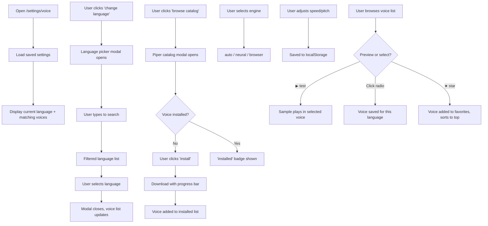

# Voice Settings Page — UI/UX Design Document

> **Route:** `/settings/voice`  
> **File:** [settings\_.voice.tsx](file:///home/sanskar/Downloads/doclens-ai/src/routes/settings_.voice.tsx)  
> **Layout:** [SidebarLayout](file:///home/sanskar/Downloads/doclens-ai/src/components/SidebarLayout.tsx)  
> **SEO Title:** `DocLens — Voice Settings`

---

## Purpose

The Voice Settings page is the **comprehensive TTS configuration center** for DocLens AI. It manages two distinct TTS engines:

1. **Neural voices (Piper)** — Offline WASM-based neural TTS models that produce high-quality, natural speech. Downloaded once and cached locally.
2. **Browser voices (Web Speech API)** — System-level speech synthesis voices provided by the browser/OS.

The page allows users to:

- Choose their document language (affecting which voices are available)
- Install, test, select, and remove Piper neural voices
- Configure TTS engine preference (auto/neural/browser)
- Adjust speech speed and pitch
- Browse, search, filter, favorite, and preview browser voices
- Set per-language voice preferences

---

## Layout Overview

```
┌──────────┬──────────────────────────────────────────┐
│  Sidebar │  Top Bar: "Voices"                       │
│  (w-64)  ├──────────────────────────────────────────┤
│          │  Scrollable Content (max-w-4xl, px-8)    │
│  ◐ Logo  │                                          │
│  📁 Lib  │  ┌── Language Selector Card ───────────┐ │
│  ⚙ Gen   │  │ DOCUMENT LANGUAGE                   │ │
│  🎙 Voice│  │ English     [change language]        │ │
│     ↑    │  │ 23 voices available                  │ │
│  active  │  └──────────────────────────────────────┘ │
│          │                                          │
│          │  ┌── Neural Voice Models (Piper) ───────┐ │
│          │  │ ENGINE: [auto] [neural] [browser]    │ │
│          │  │ ┌ Installed Voice ──────────────────┐ │ │
│          │  │ │ ◉ en_US-lessac-medium  [▶test] [×]│ │ │
│          │  │ └──────────────────────────────────┘ │ │
│          │  │                  [browse catalog]    │ │
│          │  └──────────────────────────────────────┘ │
│          │                                          │
│          │  ┌── Speed & Pitch Sliders ─────────────┐ │
│          │  │ SPEED · 1.00×   │   PITCH · 1.00     │ │
│          │  │ ═══●═══════     │   ═══●═══════      │ │
│          │  │ 0.25× 1× 4×    │   0 low 1 2 high   │ │
│          │  └──────────────────────────────────────┘ │
│          │                                          │
│          │  [matching (23)] [all voices (142)]       │
│          │  [search voices…               ]         │
│          │                                          │
│          │  ┌── Browser Voice List ────────────────┐ │
│          │  │ ◉ Google हिंदी  en-IN · Local ★ [▶] │ │
│          │  │ ○ Microsoft... en-US · Online ☆ [▶] │ │
│          │  │ ○ Google UK... en-GB · Local  ☆ [▶] │ │
│          │  │ ...                                  │ │
│          │  └──────────────────────────────────────┘ │
│          │                                          │
│          │  ℹ Selection is saved per language...    │
└──────────┴──────────────────────────────────────────┘
```

The page uses a single-column, `max-w-4xl` centered layout — narrower than the Settings page because voice configuration is inherently linear (language → engine → voice → tune).

---

## UI Components

---

### 1. Document Language Selector Card

- **Description:** A bordered card (`border border-border bg-surface`) with the current language prominently displayed.
- **Content:**
  - **Label:** "DOCUMENT LANGUAGE" in monospace, 10px uppercase tracking
  - **Language name:** The selected language in `text-xl font-semibold text-primary`
  - **Voice count:** "N voice(s) available" — count of browser voices matching the language code
  - **Change button:** "CHANGE LANGUAGE" in monospace uppercase, primary-colored pill button

#### Language Picker Modal

Triggered by the "change language" button. Full implementation:

- **Overlay:** `fixed inset-0 z-50 bg-black/60 backdrop-blur-sm`
- **Dialog:** `max-h-[85vh] w-full max-w-md rounded-xl border bg-surface shadow-2xl`
- **Header:**
  - Title: "Specify language" (`text-lg font-semibold`)
  - Close button (✕)
  - Search input (`autoFocus`) for filtering the language list
- **Language List:**
  - Scrollable (`flex-1 overflow-auto`)
  - 90 languages from Afrikaans to Zulu
  - Each item is a `<button>` with the language name
  - **Active language:** `bg-primary/10 text-primary` with ✓ checkmark
  - **Inactive:** `text-foreground hover:bg-background/60`
  - Dividers between items (`divide-y divide-border`)
- **Empty state:** "no languages match '{query}'" when search has no results
- **Behavior:**
  - Clicking a language: Sets it as the document language, saves to `localStorage`, closes modal
  - Clicking backdrop: Closes modal
  - Clicking ✕: Closes modal
  - Both close actions clear the search query

- **UX Rationale:** A modal with search is more efficient than a long dropdown for 90 languages. The search input has `autoFocus` so users can immediately type to filter. The checkmark on the active language provides clear visual confirmation.
- **Placement:** Top of the page — language selection is the foundational choice that affects everything below (which voices are shown, which neural models match, etc.).

---

### 2. Neural Voice Models (Piper) Card

- **Description:** A bordered card for managing offline Piper neural TTS voices.
- **Header:**
  - Label: "NEURAL VOICE MODELS" in monospace uppercase
  - Description: "Offline Piper voices · Brave-safe · N installed"
  - "BROWSE CATALOG" button (right-aligned)

#### 2.1 Engine Preference Toggle

- **Description:** Three inline toggle buttons labeled `auto`, `neural`, `browser`.
- **Functionality:**
  - **auto:** DocLens picks the best available engine (Piper if installed for the language, otherwise browser)
  - **neural:** Force Piper neural engine
  - **browser:** Force Web Speech API
- **Active state:** `bg-primary/15 text-primary`
- **Inactive state:** `border border-border text-muted-foreground hover:text-foreground`
- **UX Rationale:** Three engines serve different needs: "auto" for most users, "neural" for consistent offline quality, "browser" for language coverage where Piper has no models.
- **Placement:** Immediately below the section header — engine choice affects the relevance of everything that follows.

#### 2.2 Installed Voices List

When no voices are installed:

- **Empty state:** Dashed-border info box: "No neural voices installed. Click 'browse catalog' to download a Piper voice (~20–60 MB each, cached offline)."

When voices are installed:

- **Description:** A bordered list (`divide-y divide-border`) of installed voices.
- **Each row contains:**

| Element           | Description                                                                        |
| ----------------- | ---------------------------------------------------------------------------------- |
| **Radio button**  | `<input type="radio" name="preferred-piper">` — selects the preferred neural voice |
| **Voice ID**      | Monospace 12px text (e.g., `en_US-lessac-medium`)                                  |
| **Language**      | 10px muted text from catalog metadata                                              |
| **▶ test button** | Plays a sample using the Piper engine. Shows ⏳ while loading/playing.             |
| **remove button** | Deletes the voice from IndexedDB cache                                             |

- **Radio behavior:** Selecting a voice sets it as the preferred Piper voice via `localStorage`.
- **Test button:** Disabled while testing (`disabled:opacity-50`).
- **Remove behavior:** Deletes the ONNX model from IDB cache. If the removed voice was preferred, clears the preference.
- **UX Rationale:** Radio buttons make it clear that only one voice can be active. Test before committing ensures users are happy with the voice quality.

#### 2.3 Piper Catalog Modal

Triggered by "browse catalog" button.

- **Overlay:** Same as language picker (`bg-black/60 backdrop-blur-sm`)
- **Dialog:** `max-h-[85vh] w-full max-w-2xl` — wider than the language picker to accommodate metadata columns
- **Header:**
  - Title: "Piper neural voices"
  - Close button (✕)
  - Search input for filtering voices by key, name, language (native/English), or country
- **Loading state:** "loading catalog…" centered in monospace
- **Voice list:** Scrollable, each item shows:

| Element        | Description                                                  |
| -------------- | ------------------------------------------------------------ |
| **Voice name** | `{name} [{quality}]` in monospace                            |
| **Metadata**   | `{native_name} ({country}) · {quality} · {size} MB`          |
| **Action**     | "installed" badge / download "% progress" / "install" button |

- **Install behavior:**
  - Sets `downloading` state to the voice key
  - Progress callback updates percentage display
  - On success: Refreshes installed list, updates catalog cache, shows success toast
  - On failure: Error toast
- **Disabled during download:** Other install buttons show `disabled:opacity-40` while any download is active
- **UX Rationale:** Centralizing the catalog in a modal avoids navigating away from the page. The search covers multiple fields so users can search by country, language name, or voice name.

---

### 3. Speed & Pitch Controls Card

- **Description:** Bordered card with two side-by-side range sliders in a `grid-cols-1 sm:grid-cols-2` layout.

#### 3.1 Speed Slider

- **Label:** "SPEED · {value}×" where value is displayed in primary color
- **Range:** 0.25× to 4×, step 0.05
- **Tick labels:** "0.25×" — "1× normal" — "4×"
- **Default:** 1.00×
- **Functionality:** Sets the TTS speech rate. Persists to `localStorage`. Affects both Piper and browser TTS.
- **UX Rationale:** Speed control is essential for language learners (slower) and power users (faster). The wide range (0.25× to 4×) accommodates extreme use cases.

#### 3.2 Pitch Slider

- **Label:** "PITCH · {value}" where value is displayed in primary color
- **Range:** 0 to 2, step 0.05
- **Tick labels:** "0 low" — "1 normal" — "2 high"
- **Default:** 1.00
- **Functionality:** Sets the TTS pitch. Persists to `localStorage`. Primarily affects browser TTS (Piper pitch adjustment is limited).
- **UX Rationale:** Pitch adjustment helps users with hearing preferences or gender-specific voice tuning.

---

### 4. Voice Filter & Search Toolbar

- **Description:** Inline flex row with filter toggle and search input, positioned above the voice list.

#### 4.1 Filter Toggle

Two buttons in a bordered pill container:

| Button       | Label            | Function                                            |
| ------------ | ---------------- | --------------------------------------------------- |
| **matching** | `matching (N)`   | Show only voices matching the current language code |
| **all**      | `all voices (N)` | Show all available browser voices                   |

- **Active state:** `bg-primary/15 text-primary`
- **Inactive state:** `text-muted-foreground hover:text-foreground`
- **UX Rationale:** Most users care only about their language's voices. The "matching" default filters noise. The count in the label helps set expectations.

#### 4.2 Voice Search Input

- **Description:** Right-aligned `w-56` text input with monospace font and "search voices…" placeholder.
- **Functionality:** Filters voices by name or language code.
- **UX Rationale:** With potentially hundreds of voices, search enables fast lookup.

---

### 5. Browser Voice List

- **Description:** A full-width bordered list (`rounded-lg border bg-surface`) of Web Speech API voices.
- **Sorting logic:**
  1. Favorites first
  2. Language-matching voices second
  3. Alphabetical by name

#### 5.1 Voice Row

Each voice occupies a single row with these elements:

| Element             | Description                                                                                                                  |
| ------------------- | ---------------------------------------------------------------------------------------------------------------------------- |
| **Radio indicator** | Custom circular button: `h-5 w-5 rounded-full border-2`. Selected: filled green center dot. Unselected: empty circle.        |
| **Voice name**      | 14px medium weight, full row is clickable to select                                                                          |
| **Voice info**      | Monospace 11px: `{lang_code} · {type}, {region}` where type is "Local" or "Online", region is derived from the language code |
| **Star button**     | ★ (filled, yellow-400) for favorites, ☆ (outline, muted) for non-favorites. Toggle on click.                                 |
| **Preview button**  | "▶ test" / "■ stop" pill button. Plays the voice using the Smart TTS controller with a language-specific sample sentence.    |

- **Selected row highlight:** `bg-primary/5`
- **Non-selected hover:** `hover:bg-background/40`

#### Voice Info Display

The `formatVoiceInfo` function constructs descriptive metadata:

- **Type:** "Local" (installed on device) or "Online" (requires network)
- **Region:** Maps language codes to country names (e.g., `en-IN` → "India", `es-MX` → "Mexico")
- **Default flag:** Marked if the voice is the system default

#### Preview System

- **Description:** Clicking "▶ test" plays a language-specific sample sentence using the selected voice.
- **Sample sentences:** Pre-defined for 25+ languages (e.g., Hindi: "यह आवाज़ का परीक्षण है।", Japanese: "これは音声テストです。"). Falls back to English for unsupported languages.
- **Behavior:**
  - Click ▶ test → Creates a TTS controller, plays sample, button changes to "■ stop"
  - Click ■ stop → Cancels playback, button reverts to "▶ test"
  - Playback end → Button automatically reverts to "▶ test"
- **Important:** Preview does NOT change the saved voice selection. It temporarily overrides the voice for the sample, then restores the previous selection. This is explicitly noted in the footer text.

#### Selection Persistence

- **Mechanism:** Clicking a voice (radio or name) saves the selection per language via `setTtsVoiceFor(language, name)`.
- **Success feedback:** Toast notification: `Voice set to "{name}" for {language}.`

#### Favorite System

- **Mechanism:** Clicking the star toggles the voice in/out of the favorites list (persisted via `localStorage`).
- **Sort impact:** Favorited voices float to the top of the list.
- **UX Rationale:** Users who work with multiple languages can star their preferred voices for each, making them easy to find when switching contexts.

#### Empty States

| Condition          | Message                                                                                            |
| ------------------ | -------------------------------------------------------------------------------------------------- |
| No matching voices | "NO VOICES FOUND FOR {LANGUAGE}" + "Try switching to 'All voices' or choose a different language." |
| No voices at all   | "NO VOICES FOUND" + "Your browser doesn't have any voices installed."                              |

---

### 6. Web Speech API Warning

- **Description:** Destructive-styled warning banner shown when `isTtsSupported()` returns false.
- **Content:** "⚠ Web Speech API is not available in this browser. TTS features will not work."
- **UX Rationale:** Proactive notification prevents user confusion when TTS buttons don't work.

---

### 7. Footer Note

- **Description:** Monospace 11px muted text below the voice list.
- **Content:** "Selection is saved per language. Tap ▶ test to preview without changing your choice. Voice availability depends on your browser and operating system."
- **UX Rationale:** Clarifies three important points that might otherwise confuse users: per-language persistence, non-destructive preview, and platform dependency.

---

## User Journey



---

## Design Decisions

### 1. Dual TTS Engine Architecture

Supporting both Piper (neural/offline) and browser voices maximizes language coverage. Piper provides superior quality for supported languages, while the Web Speech API covers edge cases. The "auto" engine preference lets DocLens make the optimal choice transparently.

### 2. Per-Language Voice Selection

Different languages sound best with different voices. Saving voice preferences per language means a user working with Hindi and English doesn't need to reconfigure every time they switch.

### 3. Offline-First Neural Voices

Piper voices are downloaded and cached locally, enabling TTS even without internet. The 20–60 MB download size is a one-time cost. This is especially important for users in regions with intermittent connectivity.

### 4. Preview Without Commitment

The "▶ test" button deliberately does not change the saved voice selection. This encourages exploration — users can audition many voices without worrying about losing their current configuration.

### 5. Narrow Layout (max-w-4xl)

Unlike the General Settings page which uses `max-w-7xl` with multi-column grids, Voice Settings uses a narrower `max-w-4xl`. The content is inherently sequential (language → engine → voices → tune) and doesn't benefit from side-by-side comparison.

### 6. Favorites as Sort Mechanism

Rather than creating a separate "favorites" section, starred voices simply sort to the top. This keeps the list unified while giving frequently-used voices priority placement.

---

## Accessibility Considerations

| Element                    | Implementation                                                         |
| -------------------------- | ---------------------------------------------------------------------- |
| Language picker modal      | Click-outside-to-close, ✕ close button, autofocus on search            |
| Radio buttons (Piper)      | Native `<input type="radio">` with `aria-label="Set preferred"`        |
| Radio indicators (browser) | Custom `<button>` with `aria-label="Selected"` / `aria-label="Select"` |
| Star buttons               | `aria-label="Unfavorite"` / `aria-label="Favorite"`                    |
| Range sliders              | Native `<input type="range">` with label and current value display     |
| TTS unsupported warning    | Prominent destructive-colored banner with ⚠ icon                       |
| Voice names                | Rendered as `<button>` elements, clickable for selection               |
| Piper catalog modal        | Standard dialog with title, close button, search                       |

> [!TIP]
> The custom radio indicators for browser voices (`h-5 w-5 rounded-full border-2`) could benefit from ARIA role="radio" and proper `aria-checked` state for screen readers, since they're implemented as `<button>` elements rather than native radio inputs.

> [!WARNING]
> The Piper catalog modal lacks keyboard trap management — Tab key may navigate behind the modal to the page content. Consider implementing focus trapping.

---

## Future Improvement Opportunities

1. **Voice quality samples** — Play pre-recorded samples from the catalog before downloading (saving bandwidth for models the user doesn't like).
2. **Auto-download matching voice** — When a user selects a new language, offer to auto-install the best-matching Piper voice.
3. **Voice comparison mode** — Play the same sentence through multiple voices side-by-side.
4. **Custom sample text** — Let users type their own text for voice preview instead of using canned samples.
5. **Voice usage analytics** — Track which voices are most used and surface them as recommendations.
6. **Batch install** — Install multiple Piper voices at once (useful for multilingual users).
7. **Storage usage per voice** — Show how much IDB space each installed Piper voice consumes.
8. **Voice tags/categories** — Label voices by gender, accent, formality for easier browsing.
9. **Reading speed presets** — Named presets like "Learning" (0.75×), "Normal" (1×), "Speed Reading" (2×) instead of just a raw slider.
10. **Visual waveform** — Show an audio waveform visualization during voice preview playback.
11. **Import/export voice preferences** — JSON export of all per-language voice selections for backup or cross-device sync.
